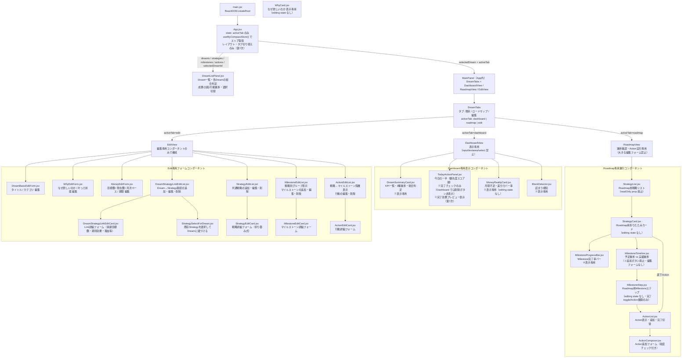
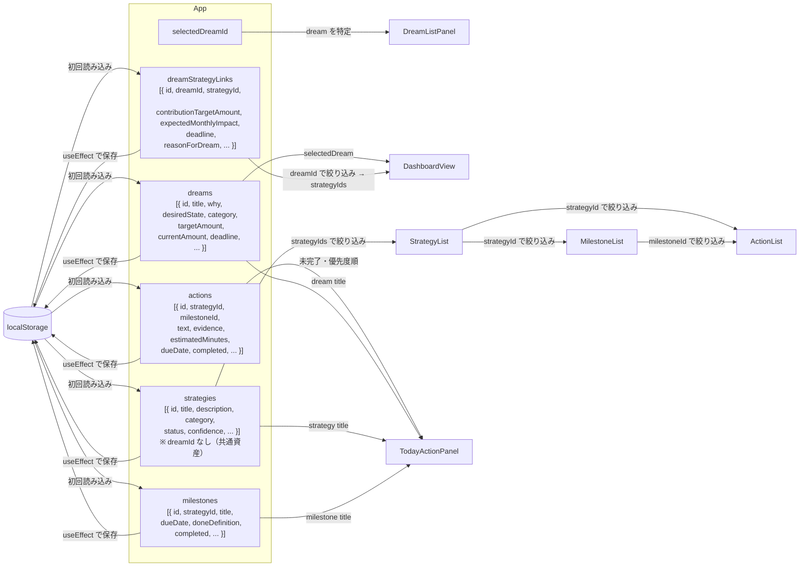
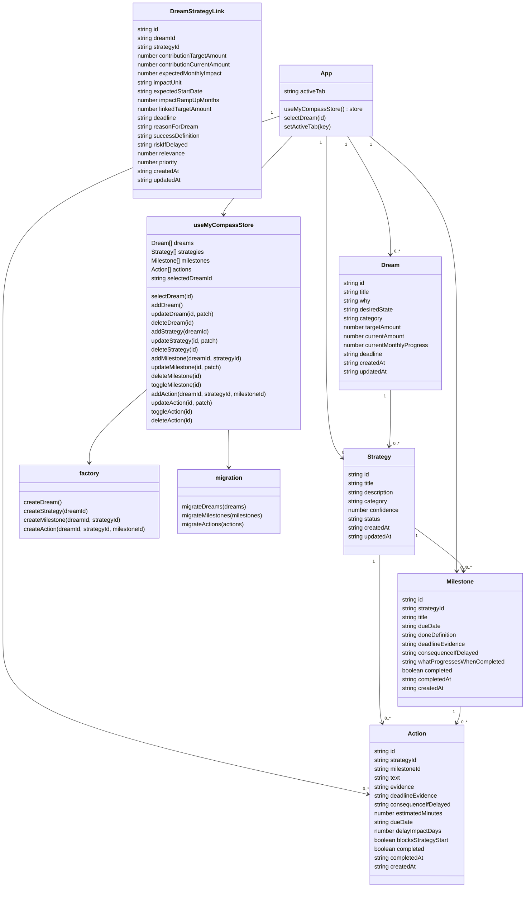
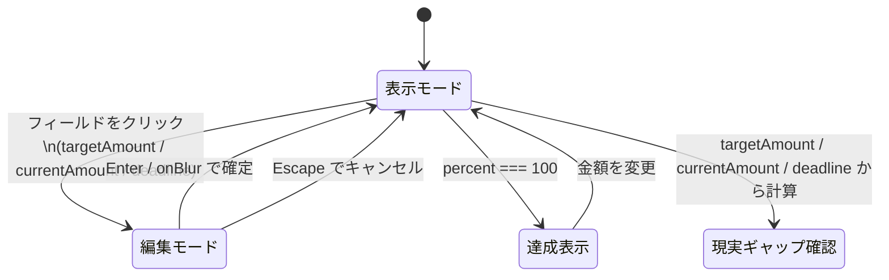
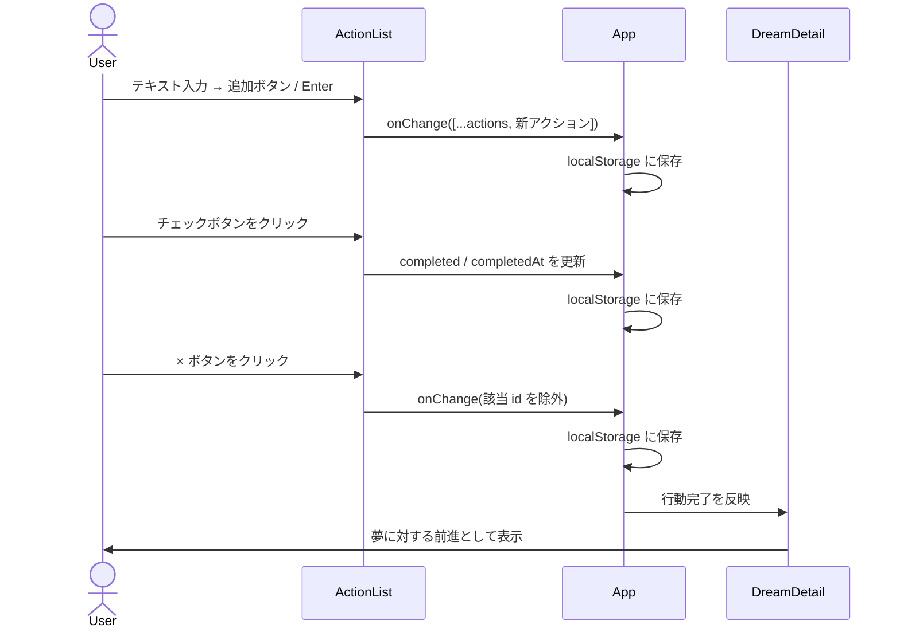
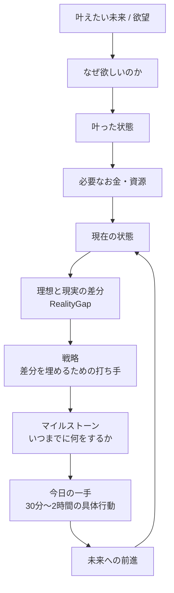
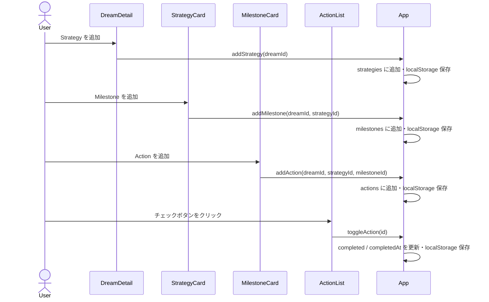
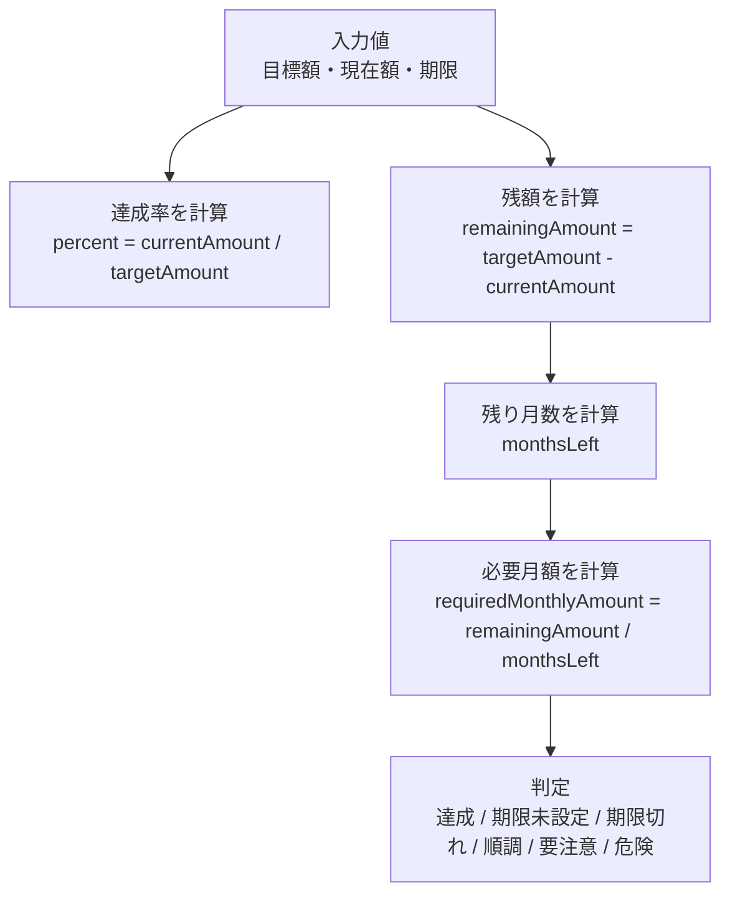
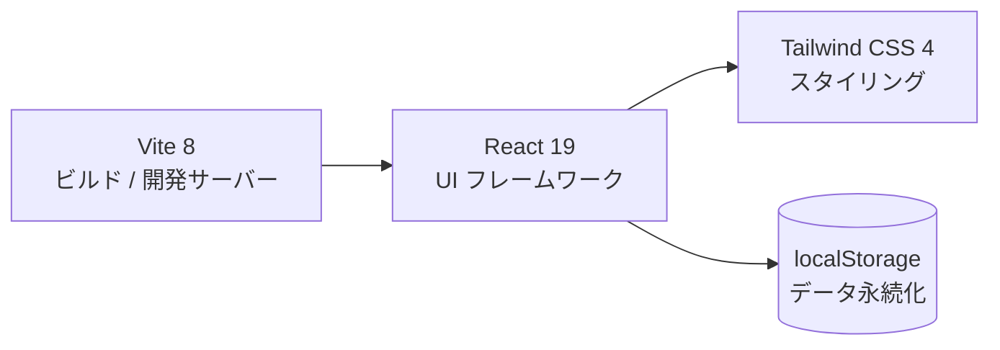

# MyCompass 設計書

## コンポーネント構成



## データフロー



## 状態定義



## MoneyGoalCard 内部状態遷移



## ActionList 操作フロー



## 欲望から行動への変換フロー



## Dream → Strategy → Milestone → Action の操作フロー



## RealityGapCard 計算フロー



## 技術スタック



## 型定義

```ts
type Dream = {
  id: string
  title: string
  why: string
  desiredState: string
  category: "home" | "birth" | "money" | "career" | "health" | "life"
  targetAmount: number
  currentAmount: number
  currentMonthlyProgress: number  // 現在の月次積立ペース（円）
  deadline: string
  createdAt: string
  updatedAt: string
}

type MilestoneComputedStatus = "completed" | "in_progress" | "not_started" | "overdue"

type DreamHealthStatus = "good" | "warning" | "danger"

// 第11次以降: dreamId / reason / expectedImpact / deadline は DreamStrategyLink に移行
type Strategy = {
  id: string
  title: string
  description: string
  category: "income" | "cost" | "asset" | "habit" | "skill"
  confidence: 1 | 2 | 3 | 4 | 5
  status: "idea" | "active" | "paused" | "done" | "abandoned"
  createdAt: string
  updatedAt: string
}

type DreamStrategyLink = {
  id: string
  dreamId: string
  strategyId: string
  contributionTargetAmount: number
  contributionCurrentAmount: number
  expectedMonthlyImpact: number
  impactUnit: "monthly_yen" | "one_time_yen" | "habit" | "knowledge"
  expectedStartDate: string          // 効果が出始める日
  impactRampUpMonths: number         // 立ち上がり期間（月）
  linkedTargetAmount: number
  deadline: string
  reasonForDream: string
  successDefinition: string
  riskIfDelayed: string
  relevance: 1 | 2 | 3 | 4 | 5
  priority: 1 | 2 | 3 | 4 | 5
  createdAt: string
  updatedAt: string
}

type Milestone = {
  id: string
  dreamId: string
  strategyId: string
  title: string
  dueDate: string
  doneDefinition: string
  deadlineEvidence: string          // なぜこの日まで？
  consequenceIfDelayed: string      // 遅れると何が起きる？
  whatProgressesWhenCompleted: string  // 完了すると何が進む？
  completed: boolean
  completedAt: string | null
  createdAt: string
}

type Action = {
  id: string
  dreamId: string
  strategyId: string | null
  milestoneId: string | null
  text: string
  evidence: string              // なぜ必要か
  deadlineEvidence: string      // なぜこの日まで？
  consequenceIfDelayed: string  // 遅れると何が起きる？
  estimatedMinutes: number
  dueDate: string
  delayImpactDays: number       // 後続が遅れる日数（第12次追加）
  blocksStrategyStart: boolean  // Strategy 開始ブロックフラグ（第12次追加）
  completed: boolean
  completedAt: string | null
  createdAt: string
}
```

## 実装方針

MyCompassは、単なる貯金管理アプリでも、単なるToDoアプリでもない。
目的は、夢・目標・欲望を、現実の行動に変換すること。

基本の流れは以下。

```
叶えたい未来 / 欲望
↓
なぜ欲しいのか
↓
叶った状態
↓
必要なお金・資源
↓
現在の状態
↓
理想と現実の差分 (RealityGap)
↓
戦略 (Strategy)
↓
マイルストーン (Milestone)
↓
今日の一手 (Action: 30分〜2時間の具体行動)
↓
未来への前進
```

Actionは「副業をする」「痩せる」「家計を改善する」のような抽象的なものにしない。
そのような抽象行動はStrategyとして登録し、ActionはStrategyまたはMilestoneに紐づく具体行動に絞る。

既存の goal 単体管理は廃止し、dreams 配列に置き換える。
既存の Action は dreamId を持つ形に拡張し、必ずどのDreamに効く行動なのか分かるようにする。

## 実装する範囲

まずは「欲望 → 数字 → 戦略 → 行動」の接続を完成させる。

実装するものは以下。

- Dreamを複数登録できる
- Dreamを選択できる
- Dreamごとに title / why / desiredState / category / targetAmount / currentAmount / deadline を編集できる
- 達成率・残額・期限までの残り月数・必要月額を表示する
- RealityGapCardの下に Strategy 作成ボタンを置く
- Strategyを追加・編集・削除できる
- Strategyに title / reason / expectedImpact / impactUnit / confidence / deadline / status を入力できる
- Strategyに紐づくMilestoneを追加・編集・削除できる
- Milestoneに title / dueDate / doneDefinition を入力できる
- ActionをStrategyまたはMilestoneに紐づけて追加できる
- Actionに text / evidence / estimatedMinutes / dueDate を入力できる
- Action追加フォームに粒度ガイドを表示する
- Actionを完了・未完了に切り替えられる
- Actionを削除できる
- 未完了Actionを「今日の一手」として期限近い順に表示する
- TodayActionPanelに Dream / Strategy / Milestone / evidence / estimatedMinutes / dueDate を表示する
- localStorageに保存し、リロードしてもデータが残る

## 後回しにする範囲

以下は後回しにする。

- DailyLog
- WeeklyReview
- グラフ表示
- Export / Import
- Zodによる厳密なバリデーション
- バックエンド連携
- ログイン機能

## localStorage key

- `mycompass:dreams`
- `mycompass:strategies`
- `mycompass:dreamStrategyLinks`（第11次追加）
- `mycompass:milestones`
- `mycompass:actions`

既存データに欠けているフィールドは以下のデフォルト値で補完する。

**Dream の補完**

| フィールド | デフォルト値 |
|---|---|
| currentMonthlyProgress | 0 |

**Milestone の補完**

| フィールド | デフォルト値 |
|---|---|
| deadlineEvidence | "" |
| consequenceIfDelayed | "" |
| whatProgressesWhenCompleted | "" |

**Action の補完**

| フィールド | デフォルト値 |
|---|---|
| strategyId | null |
| milestoneId | null |
| evidence | "" |
| deadlineEvidence | "" |
| consequenceIfDelayed | "" |
| estimatedMinutes | 30 |
| dueDate | "" |

## 初期Dream

dreams が空の場合は、初期Dreamを1件作成する。

```ts
const initialDream = {
  id: crypto.randomUUID(),
  title: "新しい夢",
  why: "",
  desiredState: "",
  category: "life",
  targetAmount: 0,
  currentAmount: 0,
  deadline: "",
  createdAt: new Date().toISOString(),
  updatedAt: new Date().toISOString()
}
```

## 初期Strategy

```ts
const initialStrategy = {
  id: crypto.randomUUID(),
  dreamId,
  title: "",
  reason: "",
  expectedImpact: 0,
  impactUnit: "monthly_yen",
  confidence: 3,
  deadline: "",
  status: "idea",
  createdAt: new Date().toISOString(),
  updatedAt: new Date().toISOString()
}
```

## 初期Milestone

```ts
const initialMilestone = {
  id: crypto.randomUUID(),
  dreamId,
  strategyId,
  title: "",
  dueDate: "",
  doneDefinition: "",
  deadlineEvidence: "",
  consequenceIfDelayed: "",
  whatProgressesWhenCompleted: "",
  completed: false,
  completedAt: null,
  createdAt: new Date().toISOString()
}
```

## 初期Action

```ts
const initialAction = {
  id: crypto.randomUUID(),
  dreamId,
  strategyId,
  milestoneId,
  text: "",
  evidence: "",
  deadlineEvidence: "",
  consequenceIfDelayed: "",
  estimatedMinutes: 30,
  dueDate: "",
  completed: false,
  completedAt: null,
  createdAt: new Date().toISOString()
}
```

## 削除時のカスケード

第11次以降の仕様（DreamStrategyLink 導入後）

| 削除対象 | 連動削除 |
|---|---|
| Dream を削除 | その Dream の DreamStrategyLink のみ削除（Strategy / Milestone / Action は残す） |
| Strategy を削除 | その Strategy の DreamStrategyLink + Milestone + Action をすべて削除 |
| Milestone を削除 | その Milestone に紐づく Action（milestoneId が一致するもの）をすべて削除 |

## 計算ロジック

MoneyGoalCardでは以下を計算する。

```ts
const percent = targetAmount > 0
  ? Math.min(100, Math.round((currentAmount / targetAmount) * 100))
  : 0

const remainingAmount = Math.max(0, targetAmount - currentAmount)
```

RealityGapCardでは以下を計算する。

```ts
function getMonthsLeft(deadline: string) {
  if (!deadline) return null
  const today = new Date()
  const end = new Date(deadline)
  const yearDiff = end.getFullYear() - today.getFullYear()
  const monthDiff = end.getMonth() - today.getMonth()
  return Math.max(0, yearDiff * 12 + monthDiff)
}

const remainingAmount = Math.max(0, targetAmount - currentAmount)
const monthsLeft = getMonthsLeft(deadline)
const requiredMonthlyAmount =
  monthsLeft && monthsLeft > 0
    ? Math.ceil(remainingAmount / monthsLeft)
    : remainingAmount
const monthlyShortfall = Math.max(0, requiredMonthlyAmount - currentMonthlyProgress)
```

状態判定は以下。

- `remainingAmount === 0`：達成
- deadlineなし：期限未設定
- `monthsLeft === 0` かつ `remainingAmount > 0`：期限切れ
- `requiredMonthlyAmount <= 50000`：順調
- `requiredMonthlyAmount <= 150000`：要注意
- `requiredMonthlyAmount > 150000`：危険

## 共有ユーティリティ（src/utils/progress.js）

```js
export function getProgressPercent(done, total) {
  if (!total || total <= 0) return 0
  return Math.min(100, Math.round((done / total) * 100))
}

export function sortByDueDate(items) {
  return [...items].sort((a, b) => {
    if (!a.dueDate && !b.dueDate) return 0
    if (!a.dueDate) return 1
    if (!b.dueDate) return -1
    return new Date(a.dueDate).getTime() - new Date(b.dueDate).getTime()
  })
}

export function isOverdue(dueDate, completed) {
  if (!dueDate || completed) return false
  return new Date(dueDate) < new Date()
}

export function formatYen(value) {
  return `${Number(value || 0).toLocaleString()}円`
}

export function getMilestoneStatus(milestone, actions) {
  const milestoneActions = actions.filter(a => a.milestoneId === milestone.id)
  const completedActions = milestoneActions.filter(a => a.completed)
  const actionProgress = milestoneActions.length > 0
    ? Math.round((completedActions.length / milestoneActions.length) * 100)
    : 0
  const overdue = milestone.dueDate && new Date(milestone.dueDate) < new Date() && !milestone.completed
  if (milestone.completed) return "completed"
  if (overdue) return "overdue"
  if (actionProgress > 0) return "in_progress"
  return "not_started"
}
```

## 進捗の3種類

MyCompassでは進捗を以下の3種類に分けて管理・表示する。

| 種類 | 定義 | 計算元 |
|---|---|---|
| 成果進捗 (Outcome Progress) | 目標金額がどれだけ達成されたか | currentAmount / targetAmount |
| 計画進捗 (Plan Progress) | Milestoneがどれだけ完了したか | 完了Milestone数 / 全Milestone数 |
| 行動進捗 (Action Progress) | Actionがどれだけ完了したか | 完了Action数 / 全Action数 |

## DreamDashboard 司令塔仕様

DreamDashboardは単なる一覧ではなく、各Dreamの状態を一目で判断できる司令塔とする。

**各Dreamカードに表示する項目**

- Dream title / deadline
- 成果進捗バー（%）
- 計画進捗バー（完了Milestone数 / 全Milestone数）
- 行動進捗バー（完了Action数 / 全Action数）
- 戦略カバー率（%）
- 期限切れAction・Milestone件数
- 今日の一手数（未完了・期限が今日以内）
- 総合判定

**総合判定ロジック**

```js
function getDreamHealthStatus({
  overdueActionCount,
  overdueMilestoneCount,
  strategyCoveragePercent,
  todayActionCount,
  planProgressPercent,
  actionProgressPercent
}) {
  if (overdueActionCount > 0 || overdueMilestoneCount > 0) return "danger"
  if (strategyCoveragePercent !== null && strategyCoveragePercent < 50) return "danger"
  if (todayActionCount === 0) return "warning"
  if (strategyCoveragePercent !== null && strategyCoveragePercent < 100) return "warning"
  if (planProgressPercent === 0 && actionProgressPercent === 0) return "warning"
  return "good"
}
```

| 値 | ラベル | 色 |
|---|---|---|
| good | 順調 | 緑 |
| warning | 要注意 | 黄 |
| danger | 要対策 | 赤 |

## Strategy 差分カバー率の計算

Dreamの必要月額に対して、戦略の合計効果がどのくらいカバーできているかを算出する。

```js
const remainingAmount = Math.max(0, dream.targetAmount - dream.currentAmount)

const requiredMonthlyAmount =
  monthsLeft && monthsLeft > 0
    ? Math.ceil(remainingAmount / monthsLeft)
    : remainingAmount

const requiredMonthlyGap = Math.max(
  0,
  requiredMonthlyAmount - dream.currentMonthlyProgress
)

const totalExpectedMonthlyImpact = strategies
  .filter(s => s.dreamId === dream.id)
  .filter(s => s.impactUnit === "monthly_yen")
  .filter(s => s.status !== "abandoned")
  .reduce((sum, s) => sum + Number(s.expectedImpact || 0), 0)

const strategyCoveragePercent =
  requiredMonthlyGap > 0
    ? Math.min(999, Math.round((totalExpectedMonthlyImpact / requiredMonthlyGap) * 100))
    : 100

const remainingMonthlyGap = Math.max(0, requiredMonthlyGap - totalExpectedMonthlyImpact)
```

**表示ルール**

- `strategyCoveragePercent >= 100`：計画上は到達可能
- `strategyCoveragePercent >= 50`：一部カバー
- `strategyCoveragePercent < 50`：戦略不足
- `requiredMonthlyGap === 0`：差分なし

## RealityGapCard 強化仕様

**表示項目**

- 目標額 / 現在額 / 残額 / 残り月数
- 必要月額
- 現在ペース（currentMonthlyProgress）
- 月間不足額（requiredMonthlyAmount − currentMonthlyProgress）
- 戦略合計効果（totalExpectedMonthlyImpact）
- 差分カバー率（strategyCoveragePercent）
- 残り必要戦略額（remainingMonthlyGap）
- 状態判定
- 「＋ 戦略を追加」ボタン

## Strategy 単位の進捗

```js
const strategyMilestones = milestones.filter(m => m.strategyId === strategy.id)
const completedMilestones = strategyMilestones.filter(m => m.completed)
const milestoneProgress = strategyMilestones.length > 0
  ? Math.round((completedMilestones.length / strategyMilestones.length) * 100)
  : 0

const strategyActions = actions.filter(a => a.strategyId === strategy.id)
const completedActions = strategyActions.filter(a => a.completed)
const actionProgress = strategyActions.length > 0
  ? Math.round((completedActions.length / strategyActions.length) * 100)
  : 0

// Milestoneがある場合はmilestoneProgressを優先
const overallProgress = strategyMilestones.length > 0 ? milestoneProgress : actionProgress
```

StrategyCardには以下を表示する。

- マイルストーン進捗：n / m 完了
- 行動進捗：n / m 完了
- 総合進捗バー

## Milestone 状態判定

```js
function getMilestoneStatus(milestone, actions) {
  const milestoneActions = actions.filter(a => a.milestoneId === milestone.id)
  const completedActions = milestoneActions.filter(a => a.completed)
  const actionProgress = milestoneActions.length > 0
    ? Math.round((completedActions.length / milestoneActions.length) * 100)
    : 0
  const overdue = milestone.dueDate && new Date(milestone.dueDate) < new Date() && !milestone.completed
  if (milestone.completed) return "completed"
  if (overdue) return "overdue"
  if (actionProgress > 0) return "in_progress"
  return "not_started"
}
```

| 状態 | ラベル | アイコン | 色 |
|---|---|---|---|
| completed | 完了 | ✅ | 緑 |
| in_progress | 進行中 | 🔵 | 青 |
| not_started | 未着手 | ⚪ | グレー |
| overdue | 期限切れ | 🔴 | 赤 |

## MilestoneTimeline 仕様

**表示順**：dueDate 昇順。dueDate なしは最後。

**MilestoneStep の表示内容**

- ステータスアイコン
- マイルストーン名（編集可）
- 期限（編集可）
- 完了条件（編集可）
- Action進捗（n / m 完了）
- 状態ラベル
- 完了チェック / 削除ボタン
- ActionList（展開式）

**予定進捗 vs 実績進捗**

```js
const plannedCompletedCount = strategyMilestones.filter(
  m => m.dueDate && new Date(m.dueDate) <= new Date()
).length

const actualCompletedCount = strategyMilestones.filter(m => m.completed).length

const plannedProgress = strategyMilestones.length > 0
  ? Math.round((plannedCompletedCount / strategyMilestones.length) * 100)
  : 0

const actualProgress = strategyMilestones.length > 0
  ? Math.round((actualCompletedCount / strategyMilestones.length) * 100)
  : 0

const delayPercent = Math.max(0, plannedProgress - actualProgress)
```

実績進捗が予定進捗を下回る場合、遅れとして視覚的に強調表示する。

## StrategyCard の構成

```
StrategyCard
├ 戦略タイトル・理由・期待効果・確信度・期限・ステータス
├ MilestoneProgressBar（Milestone完了率）
├ MilestoneTimeline（予定進捗 vs 実績進捗・ロードマップ）
│   └ MilestoneStep × n
│       └ ActionList
└ ActionList（milestoneId なしのStrategy直下Action）
```

## TodayActionPanel 優先度スコア

未完了Actionを単純な期限順ではなく優先度スコア順で表示する。

```js
function getActionPriorityScore(action, strategy, milestone) {
  let score = 0
  const today = new Date()

  if (action.dueDate) {
    const due = new Date(action.dueDate)
    const diffDays = Math.ceil((due - today) / (1000 * 60 * 60 * 24))
    if (diffDays < 0)       score += 100
    else if (diffDays === 0) score += 90
    else if (diffDays <= 3)  score += 70
    else if (diffDays <= 7)  score += 40
  }

  if (milestone?.computedStatus === "in_progress") score += 30

  if (strategy?.impactUnit === "monthly_yen") {
    score += Math.min(30, Math.round((strategy.expectedImpact || 0) / 10000))
  }

  if (action.estimatedMinutes && action.estimatedMinutes <= 60) score += 10
  if (action.evidence?.trim()) score += 5

  return score
}
```

スコア降順 → 同点は期限近い順 → 期限なしは最後。

**TodayActionPanel の各Actionに表示する項目**

- Action本文
- Dream名 / Strategy名 / Milestone名
- Milestone内Action進捗
- Evidence（なぜ必要か）
- 見積もり時間 / 期限
- 優先理由（スコア根拠の文言）

## ActionComposer 粒度チェック

警告は **強警告（strong）** と **ヒント（hint）** の2種類に分類する。登録はいずれもブロックしない。

**強警告（赤表示・実行前に気づかせる）**

| 条件 | 内容 |
|---|---|
| text が短すぎる | 10文字未満 |
| estimatedMinutes > 120 | 2時間を超える |
| text が抽象動詞で終わる | 「する」「始める」「頑張る」「改善する」「進める」 |

**ヒント（グレー表示・後で改善を促す）**

| 条件 | 内容 |
|---|---|
| dueDate が未設定 | 期限なし |
| evidence が空 | 根拠（なぜ必要か）未入力 |
| deadlineEvidence が空 | 期限の根拠（なぜこの日まで？）未入力 |
| consequenceIfDelayed が空 | 遅延影響（遅れると何が起きる？）未入力 |
| milestoneId が null | Milestoneに紐づいていない |

**警告文例（強）**

> このActionは大きすぎる可能性があります。
> 30分〜2時間で完了できる具体行動に分解してください。
> 例：副業をする → note記事タイトルを10個出す

## 詰まり検知（BlockDetector）

以下の状態を検知し、DreamDetailに表示する。

| 検知条件 | 閾値 | メッセージ例 |
|---|---|---|
| Dream に Strategy がない | — | Strategy が未作成です |
| Strategy に Milestone がない | — | 「〇〇」にマイルストーンがありません |
| Milestone に未完了Actionがない | — | 「〇〇」に次の行動がありません |
| 期限切れ Action がある | 1件〜 | 期限切れのActionが n 件あります |
| 期限切れ Milestone がある | 1件〜 | 期限切れのMilestoneが n 件あります |
| Action に期限がない | 3件〜 | 期限未設定のActionが n 件あります |
| Action に根拠がない | 3件〜 | 根拠未入力のActionが n 件あります |
| Action に期限の根拠がない | 3件〜 | 期限の根拠未入力のActionが n 件あります |
| Action に遅延影響がない | 3件〜 | 遅延影響未入力のActionが n 件あります |
| Milestone に期限の根拠がない | 2件〜 | 期限の根拠未入力のMilestoneが n 件あります |
| Milestone に遅延影響がない | 2件〜 | 遅延影響未入力のMilestoneが n 件あります |

## DreamDetail の構成

```
DreamDetail
├ DreamSummaryCard  — KPI一覧（成果/計画/行動進捗・月間不足・カバー率・今日の一手数・期限切れ）
├ TodayActionPanel  — 今日の一手（SummaryCard直下、優先度スコア順）
├ MoneyRealityCard  — MoneyGoalCard + RealityGapCard を統合
│                     目標額/現在額/残額/期限/残り月数
│                     必要月額/現在ペース/月間不足
│                     戦略合計効果/差分カバー率/あと必要な月額
│                     └ 「＋ 戦略を追加」ボタン
├ WhyCard           — 通常時：読み物カード / 編集ボタン押下時のみfrom表示
├ BlockDetector     — 詰まり検知（問題・理由・次の行動）
└ StrategyList      — 戦略リスト
    └ StrategyCard  — 折りたたみ式戦略カード（1枚ずつ）
        ├ [通常表示] タイトル・ステータス・期限・期待効果・差分への貢献・確信度・進捗
        └ [展開時] なぜ必要か・MilestoneTimeline・ActionList・編集フォーム
            ├ MilestoneProgressBar
            ├ MilestoneTimeline（予定進捗 vs 実績進捗）
            │   └ MilestoneStep — ステータスアイコン・名前・期限・完了条件
            │       └ ActionList（展開式）
            └ ActionList（Milestone未所属のStrategy直下Action）
```

## RealityGapCard の補助文

RealityGapCard には以下の補助文を表示する。

> この差分を埋めるために、戦略を作成してください。
> 例：副業収入を作る、固定費を下げる、特別費を見直す

その下に「＋ 戦略を追加」ボタンを置く。

## TodayActionPanel の仕様

- 全 Dream を横断して未完了 Action を表示する
- 期限（dueDate）が近い順に並べる
- 期限なしの Action は最後に表示する
- 各 Action に以下を表示する
  - Action 本文
  - 紐づく Dream 名
  - 紐づく Strategy 名
  - 紐づく Milestone 名
  - なぜ必要か（evidence）
  - 見積もり時間（estimatedMinutes）
  - 期限（dueDate）

## ActionComposer の粒度ガイド

Action 追加フォームには以下の注意書きを表示する。

> Action は 30 分〜2 時間で実行できる具体行動にしてください。
> 「副業をする」「痩せる」「家計を改善する」のような大きすぎる行動は、戦略として登録してください。

## UI方針

Tailwind CSSで実装する。画面構成は以下。

**PC**
- 左側：DreamListPanel（固定 lg:w-72）
  - Dream一覧・各Dreamの総合判定・3種進捗ミニバー
- 右側：タブ（現状 / ロードマップ / 編集）＋タブ内コンテンツ
  - 現状タブ：DreamSummaryCard + TodayActionPanel + MoneyRealityCard（表示） + BlockDetector
  - ロードマップタブ：StrategyList + MilestoneTimeline + ActionList
  - 編集タブ：全入力フォーム

**スマホ**
- Header
- Dream切替（DreamListPanel）
- タブ（現状 / ロードマップ / 編集）
- タブ内コンテンツ（スクロール）

スマホは縦型タイムラインを基本。PCはDreamListPanelとMainPanelが横並び。

**状態色の統一**

| 意味 | 色 |
|---|---|
| 完了 | 緑（emerald） |
| 進行中 | 青（blue / indigo） |
| 未着手 | グレー（slate） |
| 期限切れ | 赤（red） |
| 要注意 | 黄（yellow / amber） |
| 要対策 | 赤（red） |
| 順調 | 緑（emerald） |

## 文言方針

使う文言は以下。

- 夢
- 叶えたい未来
- なぜ欲しいのか
- 叶った状態
- 理想と現実の差分
- 成果進捗 / 計画進捗 / 行動進捗
- 戦略
- なぜ必要か
- 根拠
- マイルストーン
- ロードマップ
- 完了条件
- 進行中 / 未着手 / 期限切れ
- 今日の一手
- 未来に効く行動
- 詰まり検知

避ける文言は以下。

- タスク管理
- 作業
- 単なるToDo

## 完了条件

以下を満たしたら完了。

**DreamListPanel（旧DreamDashboard）**
- 成果進捗・計画進捗・行動進捗バーが表示される
- 戦略カバー率が表示される
- 期限切れ件数・今日の一手数が表示される
- 総合判定（順調 / 要注意 / 要対策）が表示される

**DreamSummaryCard（新規）**
- DreamDetailの最上部に表示される
- 成果進捗・計画進捗・行動進捗を進捗バーで表示する
- 月間不足・戦略カバー率・今日の一手数・期限切れ件数を表示する
- 総合判定バッジを表示する

**TodayActionPanel（位置変更）**
- DreamSummaryCardの直下に配置される（画面下部ではなく）
- 最優先Actionを最も目立たせる
- 2件目以降はコンパクト表示にする
- 優先度スコア順に表示される
- Dream / Strategy / Milestone / Evidence / estimatedMinutes / dueDate が表示される
- 優先理由が表示される

**MoneyRealityCard（新規・統合）**
- MoneyGoalCardとRealityGapCardが統合されMoneyRealityCardになっている
- 目標額/現在額/残額/期限/残り月数を表示する
- 必要月額/現在ペース/月間不足を表示する（月間不足を大きく表示）
- 戦略合計効果/差分カバー率/あと必要な月額を表示する（差分カバー率を大きく表示）
- 状態判定を表示する
- 「＋ 戦略を追加」ボタンを含む

**WhyCard（表示改善）**
- 通常時は読み物カードとして「なぜ欲しいのか」「叶った状態」をテキスト表示する
- 右上の「編集」ボタンを押したときのみtextareaを表示する

**編集ボタン方針**
- WhyCard・MoneyRealityCard（旧MoneyGoalCard）・StrategyCard・MilestoneStep・ActionListのフォームは常時表示しない
- 各カードの右上に「編集」ボタンを配置し、押下時のみフォームを表示する
- 保存はonBlurまたは保存ボタンで行う

**StrategyCard（折りたたみ改善）**
- 通常時はタイトル・ステータス・期限・期待効果・確信度・進捗のみコンパクト表示
- 展開時にのみ：なぜ必要か・MilestoneTimeline・ActionList・編集フォームを表示

**MilestoneTimeline**
- Milestoneが期限順に並ぶ
- 各MilestoneにcompletedStatus（完了/進行中/未着手/期限切れ）が表示される
- Milestone内のAction進捗が表示される
- 予定進捗・実績進捗・遅れ（%）が表示される

**BlockDetector（表示改善）**
- 各詰まりを「問題・理由・次の行動」の3点で表示する

**ActionComposer**
- 抽象的すぎるActionに警告が出る（登録はブロックしない）

**データ整合性**
- Dream に currentMonthlyProgress がない場合は 0 で補完される
- 既存Actionに欠けているフィールドはデフォルト値で補完される
- Dream / Strategy / Milestone 削除時にカスケード削除される
- localStorageに保存され、リロードしてもデータが残る
- `npm run build` が通る

---

## UI改善仕様（第3次改修）

### 改修方針

現在の実装は入力フォーム中心になっている。以下を重視して「現状を把握し、次にやることが分かる画面」に改める。

- 目的に接続していることが一目で分かる
- 目的に対してどのくらい進んでいるかが一目で分かる
- 今日何をやるべきかがすぐ分かる
- 入力フォームと出力表示を分ける
- 文字量を減らし、進捗バー・バッジ・大きな数字・タイムラインで見せる
- textarea / input を常時表示しない
- 編集は「編集」ボタンを押したときだけ表示する

### DreamSummaryCard 仕様

DreamDetailの最上部に選択中DreamのKPIを集約表示するカードを追加する。

**表示内容**

| 項目 | 説明 |
|---|---|
| Dream title | 選択中のDreamタイトル |
| 総合判定バッジ | good / warning / danger |
| 成果進捗 | currentAmount / targetAmount（進捗バー付き） |
| 計画進捗 | 完了Milestone数 / 全Milestone数（進捗バー付き） |
| 行動進捗 | 完了Action数 / 全Action数（進捗バー付き） |
| 月間不足 | requiredMonthlyAmount - currentMonthlyProgress |
| 戦略カバー率 | strategyCoveragePercent（%） |
| 今日の一手数 | 期限が今日以内の未完了Action数 |
| 期限切れ件数 | 期限切れの未完了Action + Milestone数 |

**表示例**

```
産休育休で余裕を持って生活できるようにする    要対策

成果進捗  ████░░░░░░ 0%
計画進捗  ████░░░░░░ 0%
行動進捗  ████░░░░░░ 0%

月間不足：125,000円  戦略カバー率：0%
今日の一手：5件     期限切れ：0件
```

**ファイル**：`src/components/DreamSummaryCard.jsx`

**Props**

```ts
interface DreamSummaryCardProps {
  dream: Dream
  strategies: Strategy[]
  milestones: Milestone[]
  actions: Action[]
}
```

### TodayActionPanel 配置変更

TodayActionPanelをDreamSummaryCardの直下に移動する（現在の画面下部から変更）。

**最優先Action（1件目）の表示**

```
最優先
[ ] プロフィール作成

理由：
副業戦略の最初のマイルストーンで、発信開始の前提になるため

見積もり：30分
期限：2026/07/14
効く夢：産休育休で余裕を持って生活できるようにする
戦略：副業で収入を得る
マイルストーン：プロフィール作成
```

- タイトルフォント・枠・背景色で最優先であることを視覚的に強調する
- 優先度スコアが最も高いActionに「最優先」ラベルを付ける

**2件目以降はコンパクト表示**

- Action本文・期限・見積もり時間のみ表示
- 詳細（理由・パンくず）は省略
- 「すべて表示」トグルで全件表示できるようにする

**TodayActionPanelの受け取りデータ**

DreamDetailから渡す場合は選択中Dreamのactionのみ。
App全体からは全dreamのactionを渡して横断表示も可能。（現在の実装を維持）

### MoneyRealityCard 仕様

MoneyGoalCard と RealityGapCard を統合して MoneyRealityCard.jsx を作成する。

**表示内容（上から順）**

```
お金の現実                      [編集]

目標額：1,500,000円
現在額：0円
残額：1,500,000円
期限：2027/06/30
残り：12ヶ月

━━ 月次分析 ━━
必要月額：125,000円
現在ペース：0円
月間不足：125,000円  ← 大きく表示（赤）

━━ 戦略効果 ━━
戦略合計効果：0円
差分カバー率：0%     ← 大きく表示
あと必要：125,000円/月

判定：要対策
```

**大きく表示する項目**

- 月間不足（赤文字・大フォント）
- 差分カバー率（状態色・大フォント）
- あと必要な月額（赤文字）

**編集モード**

右上「編集」ボタン押下時のみ、以下の入力フォームを表示する。

- 目標金額（number input）
- 現在の金額（number input）
- 現在の月収ペース（number input）
- 期限（date input）

**ファイル**：`src/components/MoneyRealityCard.jsx`

**削除するファイル**：`MoneyGoalCard.jsx`、`RealityGapCard.jsx`（MoneyRealityCardに統合）

### WhyCard 読み物カード仕様

WhyCardは通常時、入力フォームではなく読みやすいテキストとして表示する。

**通常表示**

```
なぜ欲しいのか
今のままだと赤字になる。お金を理由に育休を不安にしたくない。

叶った状態
産休育休中も毎月の生活費が不足せず、貯金を崩しすぎずに暮らせる。
```

**編集時（「編集」ボタン押下後）**

- なぜ欲しいのか → textarea
- 叶った状態 → textarea
- 「完了」ボタンで通常表示に戻る

**空の場合**

- `「なぜ欲しいのか」を入力してください` などのプレースホルダーテキストを表示する
- または「編集」ボタンを押して入力を促す

### StrategyCard 折りたたみ仕様

#### 通常表示（折りたたみ時）

```
▶  副業で収入を得る                [実行中]  [確信度●●●○○]

   期待効果：月5万円  貢献度：40%
   期限：2026/12/31
   計画 2/5  行動 3/10
```

- タイトル・ステータスバッジ・確信度
- 期待効果と差分への貢献度（strategyCoveragePercent に対するこの戦略の寄与）
- 期限
- マイルストーン進捗（n/m）・行動進捗（n/m）

#### 展開表示

```
▼  副業で収入を得る                [実行中]  [確信度●●●○○]

   なぜ必要か
   産休中に収入が途切れるため、副業で月5万円の収入源を作る。

   ロードマップ
   予定進捗 ████░░░░ 40%
   実績進捗 ██░░░░░░ 20%  ← 20%遅れ

   ⚪ プロフィール作成      期限：2026/07/14  0/1
   ⚪ 調査する             期限：2026/07/14  0/1
   ⚪ 記事を書く           期限：未設定       0/1

   [戦略直下の行動]
   [ ] テーマ選定をする  2026/07/10  30分

   [編集]
   ステータス・確信度・なぜ必要か・期待効果・単位・期限
```

**編集フォームの表示タイミング**

- 「編集」ボタンを押したときのみフォームを表示する
- 通常展開では読み取り専用のテキストとして表示する

### BlockDetector 改善仕様

各詰まりを以下の3点セットで表示する。

```
詰まり検知  2件

⚠ 戦略カバー率が0%です
  理由：月125,000円不足に対して、戦略効果が設定されていません
  次の行動：戦略の期待効果を入力してください

⚠ 未完了Actionが5件あります
  理由：今日の一手候補があります
  次の行動：最優先Actionを1つ完了してください
```

**検知項目と3点セット定義**

| 問題 | 理由 | 次の行動 |
|---|---|---|
| 戦略がない | 差分を埋める手段がない | 戦略を追加してください |
| 戦略カバー率が低い（<50%） | 月n円不足に対して戦略効果が不足 | 戦略の期待効果を入力してください |
| マイルストーンがない戦略がある | 実行計画が未定 | 「〇〇」にマイルストーンを追加してください |
| 次の行動がないマイルストーンがある | 当該マイルストーンが止まっている | 「〇〇」に行動を追加してください |
| 期限切れActionがある | 計画が遅延している | 期限切れのActionを確認・更新してください |
| 期限切れMilestoneがある | ロードマップが遅延している | 期限切れのMilestoneを確認・更新してください |
| 期限未設定Actionが多い | 優先度管理ができない | Actionに期限を設定してください |
| 根拠未入力Actionが多い | 行動の根拠が不明 | Actionに根拠（evidence）を入力してください |

### 編集ボタン方針

フォームを常時表示しない。すべてのカードで「表示モード / 編集モード」を切り替える。

**対象コンポーネント**

| コンポーネント | 通常時 | 編集時 |
|---|---|---|
| WhyCard | テキスト表示（why / desiredState） | textarea（why / desiredState） |
| MoneyRealityCard | 数値一覧表示 | number input / date input |
| StrategyCard | タイトル等の読み取り表示 | ステータス・確信度・理由等の入力フォーム |
| MilestoneStep | タイトル・期限・完了条件のテキスト | input / date / textarea |
| ActionList | Action本文・期限・見積もりのテキスト | ActionComposerフォーム |

**実装パターン**

```jsx
const [editing, setEditing] = useState(false)

// 通常表示
{!editing && (
  <div className="relative">
    <button onClick={() => setEditing(true)} className="absolute top-0 right-0 text-xs text-slate-400">
      編集
    </button>
    <p>{dream.why || '「なぜ欲しいのか」を入力...'}</p>
  </div>
)}

// 編集表示
{editing && (
  <div>
    <textarea value={draft} onChange={e => setDraft(e.target.value)} />
    <button onClick={() => { onChange({ why: draft }); setEditing(false) }}>完了</button>
  </div>
)}
```

### 視覚表現ガイドライン

以下を積極的に使用する。

| 表現 | 用途 |
|---|---|
| 進捗バー | 成果/計画/行動進捗 |
| ステータスバッジ | 総合判定・Milestone状態・Strategy状態 |
| 信号色 | 順調（緑）・要注意（黄）・要対策（赤） |
| アイコン | Milestone状態（✅🔵⚪🔴） |
| 大きな数字 | 月間不足・差分カバー率・あと必要な月額 |
| 折りたたみ | StrategyCard・MilestoneStep |
| タイムライン | MilestoneTimeline |
| 優先度ラベル | TodayActionPanel最優先Action |

**状態色の統一（更新）**

| 意味 | Tailwind |
|---|---|
| 順調 / 完了 | emerald（緑） |
| 進行中 | blue / indigo（青） |
| 未着手 | slate（グレー） |
| 期限切れ | red（赤） |
| 要注意 | yellow / amber（黄） |
| 要対策 | red（赤） |
| 最優先 | indigo bg + white text |

---

## 3画面アーキテクチャ（第4次改修）

### 改修方針

現在は「見る」「進める」「入力する」が1画面に混在しており、どの操作をすべきか分かりにくい。
3つのタブに分けることで、ユーザーが今何をすべき画面にいるかを明確にする。

| タブ | 目的 | 許可する操作 |
|---|---|---|
| 現状（Dashboard） | 見る・判断する・今日やる | TodayActionのチェックのみ |
| ロードマップ（Roadmap） | 進む・計画を進める | 展開/折りたたみ・Action完了・Action追加 |
| 編集（Edit） | 入力する・データを整える | 全フォーム（Dream/Strategy/Milestone/Action） |

### App コンポーネント状態変更

```jsx
// 追加するstateのみ（既存stateは変わらない）
const [activeTab, setActiveTab] = useState('dashboard')
// activeTab: 'dashboard' | 'roadmap' | 'edit'
```

### DreamListPanel（旧 DreamDashboard）

**ファイル**：`src/components/DreamListPanel.jsx`（`DreamDashboard.jsx` からリネーム）

**変更点**：ファイル名・コンポーネント名のみ変更。内部ロジックは同一。

**Props**（変更なし）

```ts
interface DreamListPanelProps {
  dreams: Dream[]
  strategies: Strategy[]
  milestones: Milestone[]
  actions: Action[]
  selectedDreamId: string
  onSelect: (id: string) => void
  onAdd: () => void
  onDelete: (id: string) => void
}
```

### DreamTabs 仕様

タブ切替コンポーネント。App（またはMainPanel）内にインラインで実装する。

**表示**

```
[現状]  [ロードマップ]  [編集]
```

- アクティブタブ：indigo の下線 + indigo テキスト
- 非アクティブタブ：slate テキスト + hover で slate-200 背景

**実装パターン**

```jsx
const TABS = [
  { key: 'dashboard', label: '現状' },
  { key: 'roadmap',   label: 'ロードマップ' },
  { key: 'edit',      label: '編集' },
]

<div className="flex border-b border-slate-200 mb-4">
  {TABS.map(tab => (
    <button
      key={tab.key}
      onClick={() => setActiveTab(tab.key)}
      className={`px-4 py-2 text-sm font-medium transition-colors border-b-2 -mb-px ${
        activeTab === tab.key
          ? 'text-indigo-600 border-indigo-600'
          : 'text-slate-500 border-transparent hover:text-slate-700'
      }`}
    >
      {tab.label}
    </button>
  ))}
</div>
```

### DashboardView 仕様

**目的**：現状を把握し、今日やることを判断する。

**コンポーネント構成**

```
DashboardView
├ DreamSummaryCard    ← KPI一覧・3種進捗・総合判定
├ TodayActionPanel    ← 今日の一手（チェックのみ許可）
├ MoneyRealityCard    ← 読み取り専用モードで表示（編集ボタンは非表示）
└ BlockDetector       ← 詰まり検知（問題・理由・次の行動）
```

**禁止事項**

- `<input>`, `<textarea>`, `<select>` を一切置かない
- 編集ボタン・追加ボタンを一切置かない
- 唯一許可するインタラクション：TodayActionPanel の完了チェック（`onToggle`）

**MoneyRealityCard をDashboardViewに表示する際の注意**

- `readOnly` prop（または `showEditButton={false}` prop）を渡して編集機能を非活性にする
- 表示内容（月間不足・差分カバー率・状態判定）は同じ

**ファイル**：`src/components/DashboardView.jsx`

**Props**

```ts
interface DashboardViewProps {
  dream: Dream
  strategies: Strategy[]
  milestones: Milestone[]
  actions: Action[]
  onToggleAction: (id: string) => void
  onDeleteAction: (id: string) => void
}
```

**TodayActionPanel への dreams 渡し方**

DashboardView では `dreams={[dream]}` （選択中の Dream 1件のみ）を渡す。
TodayActionPanel のパンくず表示に使うが、actions は全て同じ Dream のものなので1件で十分。

### RoadmapView 仕様

**目的**：ロードマップを進める。戦略・マイルストーン・行動を操作する。

**コンポーネント構成**

```
RoadmapView
└ StrategyList
   └ StrategyCard（折りたたみ・展開）
      ├ MilestoneProgressBar
      ├ MilestoneTimeline
      │  └ MilestoneStep（折りたたみ・展開）
      │     └ ActionList（行動完了・追加）
      └ ActionList（戦略直下Action）
```

**許可する操作**

| 操作 | 許可 |
|---|---|
| StrategyCard 展開 / 折りたたみ | ○ |
| MilestoneStep 展開 / 折りたたみ | ○ |
| Action 完了チェック | ○ |
| Action 追加（ActionComposer） | ○ |
| Milestone 追加 | ○ |
| Strategy 追加 | ○ |

**禁止する操作**

| 操作 | 禁止理由 |
|---|---|
| Dream/WhyCard/MoneyRealityCard の編集 | EditView で行う |
| Strategy のタイトル・ステータス等の編集 | EditView で行う |
| Milestone のタイトル・期限等の編集 | EditView で行う |

RoadmapViewでのStrategyCardは「展開＝閲覧＋Action操作」モードのみ使用。
編集ボタンは表示しない（または押したら「編集タブで行ってください」と案内する）。

**ファイル**：`src/components/RoadmapView.jsx`

**Props**

```ts
interface RoadmapViewProps {
  strategies: Strategy[]
  milestones: Milestone[]
  actions: Action[]
  onAddStrategy: () => void
  onAddMilestone: (strategyId: string) => void
  onToggleMilestone: (id: string) => void
  onAddAction: (strategyId: string | null, milestoneId: string | null, fields: object) => void
  onToggleAction: (id: string) => void
  onDeleteAction: (id: string) => void
}
```

**空状態の表示**

`strategies.length === 0` の場合は「まだ戦略がありません」と「＋ 最初の戦略を追加」ボタンを表示する。
誘導テキスト（「編集タブで追加してください」）は表示しない — ボタンで直接追加できるため。

### EditView 仕様

**目的**：全データを入力・編集する。入力フォームはここに集約する。

**コンポーネント構成**

```
EditView
├ DreamEditForm（インライン）  ← タイトル・カテゴリ
├ WhyCard（autoEdit=true）    ← 入力フォームをデフォルト表示
├ MoneyRealityCard            ← 編集ボタン付き（readOnly=false）
├ BlockDetector               ← 何を入力すべきかのガイド
└ StrategyList                ← 戦略・マイルストーン・行動の全編集
```

**WhyCard の autoEdit**

`<WhyCard autoEdit />` を渡すと mount 時から editing=true（フォーム直接表示）。
キャンセルまたは完了後は通常の表示モードに戻り、「編集」ボタンで再度開ける。

**許可する操作**（EditViewはすべての編集を許可）

- DreamのすべてのフィールドをCRUD
- StrategyのすべてのフィールドをCRUD
- MilestoneのすべてのフィールドをCRUD
- ActionのすべてのフィールドをCRUD

**実装優先度**

既存コンポーネントの編集フォームを EditView に移植する形で実装する。
- WhyEditForm = WhyCard の編集モード部分を抽出
- MoneyEditForm = MoneyRealityCard の編集モード部分を抽出
- StrategyEditList = StrategyCard の編集モード部分を集約リスト形式に
- MilestoneEditList = MilestoneStep の編集フォームを集約リスト形式に
- ActionEditList = ActionComposer ベースの編集リスト

**ファイル**：`src/components/EditView.jsx`

**Props**

```ts
interface EditViewProps {
  dream: Dream
  strategies: Strategy[]
  milestones: Milestone[]
  actions: Action[]
  onChange: (patch: Partial<Dream>) => void
  onAddStrategy: () => void
  onUpdateStrategy: (id: string, patch: Partial<Strategy>) => void
  onDeleteStrategy: (id: string) => void
  onAddMilestone: (strategyId: string) => void
  onUpdateMilestone: (id: string, patch: Partial<Milestone>) => void
  onDeleteMilestone: (id: string) => void
  onAddAction: (strategyId: string | null, milestoneId: string | null, fields: object) => void
  onUpdateAction?: (id: string, patch: Partial<Action>) => void
  onDeleteAction: (id: string) => void
}
```

### PC レイアウト

```
┌─────────────────────────────────────────────────────────┐
│  🧭 MyCompass  叶えたい未来を、今日の一手に変える          │  header
├──────────────┬──────────────────────────────────────────┤
│              │  [現状]  [ロードマップ]  [編集]             │  DreamTabs
│ DreamList    ├──────────────────────────────────────────┤
│ Panel        │                                           │
│ (lg:w-72)    │  DashboardView / RoadmapView / EditView  │
│ 固定         │                                           │
│              │                                           │
└──────────────┴──────────────────────────────────────────┘
```

- 左パネル（DreamListPanel）は固定幅 `lg:w-72 flex-shrink-0`
- 右パネル（MainPanel）は `flex-1 min-w-0`
- タブはMainPanelの最上部

### モバイルレイアウト

```
┌─────────────────────────┐
│  🧭 MyCompass           │  header
├─────────────────────────┤
│  Dream切替              │  DreamListPanel（横スクロール or ドロップダウン）
├─────────────────────────┤
│  [現状] [ロードマップ] [編集] │  DreamTabs
├─────────────────────────┤
│                         │
│  タブ内コンテンツ         │  DashboardView / RoadmapView / EditView
│                         │
└─────────────────────────┘
```

- DreamListPanelはモバイルでは横スクロールカード列またはドロップダウン形式
- タブはスティッキーで上部固定が望ましい

### App.jsx の変更点

```jsx
// 追加するimport
import DreamListPanel from './components/DreamListPanel'  // DreamDashboard → DreamListPanel
import DashboardView from './components/DashboardView'
import RoadmapView from './components/RoadmapView'
import EditView from './components/EditView'

// 追加するstate
const [activeTab, setActiveTab] = useState('dashboard')

// JSX変更（DreamDashboard → DreamListPanel、DreamDetail → タブ制御に変更）
<DreamListPanel ... />

{/* タブ */}
<div className="flex border-b border-slate-200 mb-4">
  {TABS.map(tab => <button key={tab.key} ...>{tab.label}</button>)}
</div>

{/* タブコンテンツ */}
{activeTab === 'dashboard' && <DashboardView ... />}
{activeTab === 'roadmap'   && <RoadmapView ... />}
{activeTab === 'edit'      && <EditView ... />}
```

### 完了条件（第4次改修）

**DreamListPanel**
- 旧 DreamDashboard と同一機能が動作する
- ファイル名が `DreamListPanel.jsx` になっている
- App からのインポートが `DreamListPanel` になっている

**DreamTabs**
- 「現状」「ロードマップ」「編集」の3タブが表示される
- タブをクリックすると表示が切り替わる
- アクティブタブが indigo で強調される

**DashboardView**
- DreamSummaryCard が表示される
- TodayActionPanel が表示され、完了チェックができる
- MoneyRealityCard が読み取り専用で表示される
- BlockDetector が表示される
- input / textarea / select が一切ない

**RoadmapView**
- StrategyList → StrategyCard → MilestoneTimeline → MilestoneStep → ActionList が表示される
- 展開 / 折りたたみができる
- Action の完了チェックができる
- Action の追加ができる
- 編集フォーム（Strategy/Milestone の input 等）は表示されない

**EditView**
- Dream タイトル・カテゴリを編集できる
- なぜ欲しいのか・叶った状態を編集できる（WhyCard がデフォルトでフォームを表示する）
- 目標額・現在額・月次ペース・期限を編集できる
- Strategy を追加・編集・削除できる
- Milestone を追加・編集・削除できる
- Action を追加・編集・削除できる

---

## バグ修正・UX改善（第5次改修）

第4次実装後のレビューで発見した問題を修正した。

### 修正内容

**1. BlockDetector の「次の行動」テキスト修正**

- 修正前：「下の「＋ 戦略を追加」ボタンで戦略を追加してください」
- 修正後：「「編集」タブから戦略を追加してください」
- 理由：DashboardView では MoneyRealityCard が readOnly のため「戦略を追加」ボタンが存在せず、指示通りに動けない

**2. RoadmapView 空状態メッセージの矛盾を解消**

- 修正前：「編集タブで戦略を追加してください」という誘導文＋追加ボタン（矛盾）
- 修正後：「まだ戦略がありません」＋追加ボタンのみ
- 理由：誘導とボタンが矛盾していた

**3. WhyCard に autoEdit prop を追加**

- `WhyCard` に `autoEdit = false` prop を追加
- `useState(autoEdit)` で mount 時から editing=true にできる
- EditView では `<WhyCard autoEdit />` を渡し、フォームを即表示
- 理由：「編集タブ」に来たのにさらに「編集」ボタンを押す二重手順の解消

**4. DashboardView の dreams prop 削除・簡略化**

- 修正前：`dreams: Dream[]`（全 Dream 配列）を受け取り TodayActionPanel に渡していた
- 修正後：`dreams={[dream]}`（選択中の Dream 1件）を TodayActionPanel に渡す
- 理由：DashboardView の actions は全て selectedDream のものなのでパンくず表示に1件あれば充分

**5. RoadmapView の未使用 `dream` prop 削除**

- Props から `dream` を削除
- 理由：関数内で一度も参照されていなかった

**6. 不要ファイル削除（6件）**

以下の旧実装ファイルをリポジトリから削除した。

| 削除ファイル | 理由 |
|---|---|
| `DreamDashboard.jsx` | `DreamListPanel.jsx` に置き換え済み |
| `DreamDetail.jsx` | 3ビュー（Dashboard/Roadmap/Edit）に分割済み |
| `MilestoneCard.jsx` | 旧実装（未使用） |
| `MilestoneList.jsx` | 旧実装（未使用） |
| `MoneyGoalCard.jsx` | `MoneyRealityCard.jsx` に統合済み |
| `RealityGapCard.jsx` | `MoneyRealityCard.jsx` に統合済み |

### 残存する既知の問題（第5次時点）

| 問題 | 優先度 | 対応方針 |
|---|---|---|
| タブ切替で未保存の編集内容が消える | 中 | タブ離脱前に警告 or 自動保存 |
| DashboardView に「なぜ欲しいのか」が表示されない | 低 | WhyCard の読み取り表示を Dashboard にも追加するか検討 |
| EditView で MoneyRealityCard がデフォルト閲覧モード | 低 | → 第6次改修で MoneyEditForm として別コンポーネント化により解決 |

---

## コンポーネント責務分離（第6次改修）

### 改修方針

3画面タブは実現できたが、`MoneyRealityCard` / `WhyCard` / `StrategyCard` などが
「表示」と「編集」の両方の責務を持ったまま `readOnly` prop で制御されており、
コンポーネント責務が混在していた。

今回は「表示専用」「Roadmap進行専用」「編集専用」に完全分離する。

| 分類 | 方針 |
|---|---|
| 表示専用 | editing state / draft state / input / onChange を一切持たない |
| Roadmap進行専用 | 完了チェック・Action追加・Milestone展開のみ許可 |
| 編集専用 | 各エンティティに対応したフォームコンポーネントを新規作成 |

**廃止したパターン**：`readOnly` prop での同一コンポーネントの無理な使い回し

### 変更ファイル一覧

#### 表示専用に変換（既存ファイルを書き換え）

| ファイル | 削除したもの |
|---|---|
| `MoneyRealityCard.jsx` | editing state, draft, onChange, readOnly, onAddStrategy, 保存ボタン, キャンセルボタン |
| `WhyCard.jsx` | editing state, draft, onChange, autoEdit, 編集ボタン, 保存ボタン |
| `MilestoneStep.jsx` | 編集フォーム（title/dueDate/doneDefinition input）, onChange, onDelete, readOnly |
| `MilestoneTimeline.jsx` | ＋追加ボタン, onAdd, onUpdate, onDelete, readOnly |
| `StrategyCard.jsx` | 編集フォーム（全フィールド）, editing state, draft, onChange, onDelete, readOnly |
| `StrategyList.jsx` | readOnly, onUpdate, onDelete, onAddMilestone, onUpdateMilestone, onDeleteMilestone |

#### 新規作成（編集専用コンポーネント）

| ファイル | 役割 |
|---|---|
| `DreamBasicEditForm.jsx` | タイトル・カテゴリ編集（EditView に統合） |
| `MoneyEditForm.jsx` | 目標額 / 現在額 / 月次ペース / 期限 編集（即時 onChange） |
| `WhyEditForm.jsx` | なぜ欲しいのか / 叶った状態 編集（即時 onChange） |
| `StrategyEditCard.jsx` | 戦略詳細フォーム（折り畳み式・デフォルト展開） |
| `StrategyEditList.jsx` | 戦略一覧＋追加・削除ボタン |
| `MilestoneEditCard.jsx` | マイルストーン編集フォーム（インライン表示） |
| `MilestoneEditList.jsx` | 戦略別グループ表示・マイルストーン追加・削除 |
| `ActionEditCard.jsx` | Action 詳細編集フォーム（text/evidence/estimatedMinutes/dueDate） |
| `ActionEditList.jsx` | 戦略→マイルストーン階層表示・Action 編集・削除 |

#### View・App 更新

| ファイル | 変更内容 |
|---|---|
| `EditView.jsx` | 編集専用コンポーネントのみで構成に全面書き換え |
| `DashboardView.jsx` | MoneyRealityCard の不要 props（onChange/onAddStrategy/readOnly）削除 |
| `RoadmapView.jsx` | 進行操作専用 props のみ（Strategy/Milestone CRUD 削除） |
| `App.jsx` | `updateAction(id, patch)` 追加、RoadmapView/EditView の props 整理 |

### 各ビューの最終コンポーネント構成

#### DashboardView（表示専用）

```
DashboardView
├ DreamSummaryCard      ← KPI・3種進捗・総合判定（表示のみ）
├ TodayActionPanel      ← 今日の一手（完了チェック・削除のみ）
├ MoneyRealityCard      ← 月間不足・差分カバー率（表示のみ）
└ BlockDetector         ← 詰まり検知（表示のみ）
```

#### RoadmapView（進行専用）

```
RoadmapView
└ StrategyList
   └ StrategyCard（折りたたみ・展開のみ）
      ├ MilestoneProgressBar
      ├ MilestoneTimeline（完了toggle・Action展開のみ）
      │  └ MilestoneStep（完了toggle・Action展開）
      │     └ ActionList（追加・完了チェック・削除）
      └ ActionList（戦略直下・追加・完了チェック・削除）
```

#### EditView（編集専用）

```
EditView
├ DreamBasicEditForm    ← タイトル・カテゴリ
├ MoneyEditForm         ← 目標額・現在額・月次ペース・期限
├ WhyEditForm           ← なぜ欲しいのか・叶った状態
├ StrategyEditList
│  └ StrategyEditCard  ← 戦略全フィールド編集・削除
├ MilestoneEditList
│  └ MilestoneEditCard ← マイルストーン全フィールド編集・削除
└ ActionEditList
   └ ActionEditCard    ← Action全フィールド編集・削除
```

### Props 変更一覧

#### MoneyRealityCard

```ts
// 第6次以前
interface MoneyRealityCardProps {
  dream: Dream
  strategies: Strategy[]
  onChange: (patch: Partial<Dream>) => void
  onAddStrategy: () => void
  readOnly?: boolean
}

// 第6次以降（表示専用）
interface MoneyRealityCardProps {
  dream: Dream
  strategies: Strategy[]
}
```

#### WhyCard

```ts
// 第6次以前
interface WhyCardProps {
  dream: Dream
  onChange: (patch: Partial<Dream>) => void
  autoEdit?: boolean
}

// 第6次以降（表示専用）
interface WhyCardProps {
  dream: Dream
}
```

#### StrategyCard

```ts
// 第6次以前
interface StrategyCardProps {
  strategy: Strategy
  milestones: Milestone[]
  actions: Action[]
  onChange: (patch: Partial<Strategy>) => void
  onDelete: () => void
  onAddMilestone: () => void
  onUpdateMilestone: (id: string, patch: Partial<Milestone>) => void
  onDeleteMilestone: (id: string) => void
  onToggleMilestone: (id: string) => void
  onAddAction: (milestoneId: string | null, fields: object) => void
  onToggleAction: (id: string) => void
  onDeleteAction: (id: string) => void
  readOnly?: boolean
}

// 第6次以降（Roadmap進行専用）
interface StrategyCardProps {
  strategy: Strategy
  milestones: Milestone[]
  actions: Action[]
  onToggleMilestone: (id: string) => void
  onAddAction: (milestoneId: string | null, fields: object) => void
  onToggleAction: (id: string) => void
  onDeleteAction: (id: string) => void
}
```

#### MilestoneStep

```ts
// 第6次以前
interface MilestoneStepProps {
  milestone: Milestone
  actions: Action[]
  onChange: (patch: Partial<Milestone>) => void
  onDelete: () => void
  onToggle: () => void
  onAddAction: (fields: object) => void
  onToggleAction: (id: string) => void
  onDeleteAction: (id: string) => void
  readOnly?: boolean
}

// 第6次以降（Roadmap進行専用）
interface MilestoneStepProps {
  milestone: Milestone
  actions: Action[]
  onToggle: () => void
  onAddAction: (fields: object) => void
  onToggleAction: (id: string) => void
  onDeleteAction: (id: string) => void
}
```

#### MilestoneTimeline

```ts
// 第6次以前
interface MilestoneTimelineProps {
  milestones: Milestone[]
  actions: Action[]
  onAdd: () => void
  onUpdate: (id: string, patch: Partial<Milestone>) => void
  onDelete: (id: string) => void
  onToggle: (id: string) => void
  onAddAction: (milestoneId: string, fields: object) => void
  onToggleAction: (id: string) => void
  onDeleteAction: (id: string) => void
  readOnly?: boolean
}

// 第6次以降（Roadmap進行専用）
interface MilestoneTimelineProps {
  milestones: Milestone[]
  actions: Action[]
  onToggle: (id: string) => void
  onAddAction: (milestoneId: string, fields: object) => void
  onToggleAction: (id: string) => void
  onDeleteAction: (id: string) => void
}
```

#### RoadmapView

```ts
// 第6次以前
interface RoadmapViewProps {
  strategies: Strategy[]
  milestones: Milestone[]
  actions: Action[]
  onAddStrategy: () => void
  onUpdateStrategy: (id: string, patch: Partial<Strategy>) => void
  onDeleteStrategy: (id: string) => void
  onAddMilestone: (strategyId: string) => void
  onUpdateMilestone: (id: string, patch: Partial<Milestone>) => void
  onDeleteMilestone: (id: string) => void
  onToggleMilestone: (id: string) => void
  onAddAction: (strategyId: string | null, milestoneId: string | null, fields: object) => void
  onToggleAction: (id: string) => void
  onDeleteAction: (id: string) => void
}

// 第6次以降（進行専用）
interface RoadmapViewProps {
  strategies: Strategy[]
  milestones: Milestone[]
  actions: Action[]
  onToggleMilestone: (id: string) => void
  onAddAction: (strategyId: string | null, milestoneId: string | null, fields: object) => void
  onToggleAction: (id: string) => void
  onDeleteAction: (id: string) => void
}
```

#### EditView

```ts
// 第6次以降（編集専用コンポーネント構成）
interface EditViewProps {
  dream: Dream
  strategies: Strategy[]
  milestones: Milestone[]
  actions: Action[]
  onChange: (patch: Partial<Dream>) => void
  onAddStrategy: () => void
  onUpdateStrategy: (id: string, patch: Partial<Strategy>) => void
  onDeleteStrategy: (id: string) => void
  onAddMilestone: (strategyId: string) => void
  onUpdateMilestone: (id: string, patch: Partial<Milestone>) => void
  onDeleteMilestone: (id: string) => void
  onToggleMilestone: (id: string) => void
  onUpdateAction: (id: string, patch: Partial<Action>) => void
  onToggleAction: (id: string) => void
  onDeleteAction: (id: string) => void
}
```

### App.jsx 変更点

#### 追加した関数

```js
function updateAction(id, patch) {
  setActions(prev => prev.map(a => a.id === id ? { ...a, ...patch } : a))
}
```

#### RoadmapView への prop 削減

```jsx
// 第6次以降
<RoadmapView
  strategies={dreamStrategies}
  milestones={dreamMilestones}
  actions={dreamActions}
  onToggleMilestone={toggleMilestone}
  onAddAction={(strategyId, milestoneId, fields) =>
    addAction(selectedDream.id, strategyId, milestoneId, fields)
  }
  onToggleAction={toggleAction}
  onDeleteAction={deleteAction}
/>
```

### ActionEditList の階層表示仕様

ActionEditList では Action を「戦略 → マイルストーン」の階層でグループ化して表示する。

```
ActionEditList
├ 🎯 戦略A
│  ├ 📍 マイルストーン1
│  │  └ ActionEditCard（マイルストーン紐づきAction）
│  └ 戦略直下の行動
│     └ ActionEditCard
├ 🎯 戦略B
│  └ ...
└ その他の行動（strategyId = null の Action）
   └ ActionEditCard
```

ActionEditCard では以下フィールドを編集できる：
- `text`（タイトル行インライン編集）
- `evidence`（根拠・textarea）
- `estimatedMinutes`（見積もり分数・number input）
- `dueDate`（期限・date input）
- `completed`（完了toggle）

### MilestoneEditList の戦略別グループ仕様

```
MilestoneEditList
├ 🎯 戦略A                [＋ 追加]
│  └ MilestoneEditCard
│     ├ ✓ タイトル（インライン input）
│     ├ 期限（date input）
│     ├ 完了条件（textarea）
│     └ × 削除ボタン
└ 🎯 戦略B                [＋ 追加]
   └ ...
```

### 完了条件（第6次改修）

- [x] MoneyRealityCard が表示専用になっている（editing state なし）
- [x] MoneyEditForm が新規作成されている
- [x] WhyCard が表示専用になっている（editing state なし）
- [x] WhyEditForm が新規作成されている
- [x] StrategyCard から大きな編集フォームが分離されている
- [x] StrategyEditList / StrategyEditCard が新規作成されている
- [x] MilestoneEditList / MilestoneEditCard が新規作成されている
- [x] ActionEditList / ActionEditCard が新規作成されている
- [x] EditView が編集専用コンポーネントのみで構成されている
- [x] DashboardView に input / textarea / select が常時表示されない
- [x] RoadmapView は進捗確認と Action 実行に集中している
- [x] readOnly prop による無理な使い回しが排除されている
- [x] App.jsx に updateAction が追加されている
- [x] localStorage の既存データを壊さない
- [x] npm run build が通る（42モジュール、エラーなし）

---

## App.jsx 責務分離・UX改善（第7次改修）

### 改修方針

App.jsx にエンティティ生成・マイグレーション・CRUD が全部入りになっていたため、
関心事ごとにファイルを分割しつつ、いくつかの UX を改善した。

### 新規ファイル

| ファイル | 役割 |
|---|---|
| `src/utils/factory.js` | エンティティ生成（createDream / createStrategy / createMilestone / createAction） |
| `src/utils/migration.js` | データ補完（migrateDreams / migrateActions） |
| `src/hooks/useMyCompassStore.js` | localStorage 読み書き + 全 CRUD ステート |
| `.prettierrc` | コードフォーマット設定（semi:false, singleQuote:true, printWidth:100） |

### App.jsx の変更

第7次以降、App.jsx はレイアウトとタブ切り替えのみを担う。

```jsx
// App.jsx（第7次以降）
import { useMyCompassStore } from './hooks/useMyCompassStore'

export default function App() {
  const store = useMyCompassStore()
  const [activeTab, setActiveTab] = useState('dashboard')

  function selectDream(id) {
    store.selectDream(id)
    setActiveTab('dashboard')   // ← 夢切替と同時にタブをリセット
  }

  // ...レイアウト・タブ JSX のみ
}
```

**selectDream の実装注意**：`useMyCompassStore` の `selectDream` は selectedDreamId のみ更新する。`setActiveTab('dashboard')` は App.jsx 側で同期呼び出しして、タブリセットとの二段階 setState 問題を回避する。

### useMyCompassStore の設計

モジュールレベル `const _init = loadInitialState()` でストアを初期化する。
React StrictMode のダブルレンダリング対策として、localStorage 読み込みを厳密に1回に限定。

```js
const _init = loadInitialState()   // モジュール評価時に1度だけ実行

export function useMyCompassStore() {
  const [dreams, setDreams] = useState(_init.dreams)
  // ...
}
```

### DashboardView — Action 削除を廃止

| 変更点 | 詳細 |
|---|---|
| `onDeleteAction` prop を削除 | DashboardView は onToggleAction のみ受け取る |
| TodayActionPanel への `onDelete` を渡さない | Dashboard では削除ボタンは表示されない |
| Action 削除は EditView の ActionEditList のみ | 責務を明確化 |

#### DashboardView Props（第7次以降）

```ts
interface DashboardViewProps {
  dream: Dream
  strategies: Strategy[]
  milestones: Milestone[]
  actions: Action[]
  onToggleAction: (id: string) => void
  // onDeleteAction は廃止
}
```

### TodayActionPanel — 変更点

#### onDelete を省略可能に

```ts
interface TodayActionPanelProps {
  actions: Action[]          // 未完了 Action（表示対象）
  allActions: Action[]       // 全 Action（完了効果計算用・省略時は actions を使用）
  dreams: Dream[]
  strategies: Strategy[]
  milestones: Milestone[]
  onToggle: (id: string) => void
  onDelete?: (id: string) => void  // ← 省略可能（DashboardView からは渡さない）
}
```

`onDelete` が undefined の場合、TopAction・CompactAction ともに `×` ボタンを描画しない。

#### 完了効果プレビュー（TopAction に追加）

最優先 Action に「これを完了すると何が変わるか」を緑バッジで表示する。

```
✓ これを完了すると、マイルストーン「プロフィール作成」が 0/1 → 1/1 になります
```

Milestone に紐づかない Action の場合：`行動進捗が進みます`

**計算ロジック**

```js
function getCompletionEffect(action, milestone, allActions) {
  if (!milestone) return '行動進捗が進みます'
  const msActions = allActions.filter(a => a.milestoneId === milestone.id)
  const completedBefore = msActions.filter(a => a.completed).length
  const total = msActions.length
  const after = completedBefore + 1
  const title = milestone.title || '（無題）'
  return `マイルストーン「${title}」が ${completedBefore}/${total} → ${after}/${total} になります`
}
```

`allActions` は DashboardView が渡す「夢の全 Action（完了済み含む）」。
`actions`（表示対象）は未完了のみなので、完了済みカウントを正しく得るために分けている。

### RoadmapView — 空状態を改善

空状態に説明文と「編集タブで戦略を追加する」ボタンを追加。

```tsx
// strategies.length === 0 の場合
<div className="... text-center">
  <p className="text-2xl mb-3">🗺️</p>
  <p className="text-sm font-medium text-slate-600 mb-1">まだ戦略がありません</p>
  <p className="text-xs text-slate-400 mb-5">
    夢を実現するための戦略を追加すると、ここにロードマップが表示されます
  </p>
  <button onClick={onGoToEdit} className="...">
    編集タブで戦略を追加する
  </button>
</div>
```

#### RoadmapView Props（第7次以降）

```ts
interface RoadmapViewProps {
  strategies: Strategy[]
  milestones: Milestone[]
  actions: Action[]
  onToggleMilestone: (id: string) => void
  onAddAction: (strategyId: string | null, milestoneId: string | null, fields: object) => void
  onToggleAction: (id: string) => void
  onDeleteAction: (id: string) => void
  onGoToEdit: () => void   // ← 追加（空状態ボタンで呼ばれる）
}
```

### MoneyRealityCard — カバー率未計算時のフォールバック

`requiredMonthlyGap === 0`（月間不足ゼロ）かつ `targetAmount > 0` の場合、
戦略効果セクションの代わりに説明文を表示する。

```jsx
{requiredMonthlyGap > 0 ? (
  <div className="border border-slate-100 rounded-xl p-3">
    {/* 戦略効果・差分カバー率 */}
  </div>
) : targetAmount > 0 && (
  <p className="text-xs text-slate-400 text-center py-2">
    目標額・期限・現在ペースを入力すると戦略カバー率が表示されます
  </p>
)}
```

### Prettier 導入

`npm install --save-dev prettier` で導入し、`src/` 全体をフォーマット済み。

| ファイル | 設定値 |
|---|---|
| `.prettierrc` | `semi: false` / `singleQuote: true` / `printWidth: 100` |

### 完了条件（第7次改修）

- [x] DashboardView は `onDeleteAction` を受け取らず TodayActionPanel に `onDelete` を渡さない
- [x] TodayActionPanel の `×` ボタンは `onDelete` が undefined の場合に非表示
- [x] Action 削除は EditView の ActionEditList のみで行える
- [x] `src/utils/factory.js` が作成されている（createDream / createStrategy / createMilestone / createAction）
- [x] `src/utils/migration.js` が作成されている（migrateDreams / migrateActions）
- [x] `src/hooks/useMyCompassStore.js` が作成されている（localStorage + 全 CRUD）
- [x] App.jsx がレイアウト・タブ切り替えのみになっている
- [x] RoadmapView の空状態に説明文と「編集タブで戦略を追加する」ボタンがある
- [x] ボタン押下で `onGoToEdit()` が呼ばれ activeTab が edit に切り替わる
- [x] MoneyRealityCard で `requiredMonthlyGap === 0` かつ `targetAmount > 0` の場合にフォールバックテキストが表示される
- [x] TodayActionPanel の最優先 Action に完了効果プレビューが表示される
- [x] `.prettierrc` が追加されている（semi:false, singleQuote:true, printWidth:100）
- [x] `src/` 全体が Prettier でフォーマットされている
- [x] README が MyCompass 専用の内容に書き換えられている
- [x] npm run build が通る（45モジュール、エラーなし）

---

## 行動したくなるUI（第8次改修）

### 改修方針

「なんとなく行動している」ではなく「なぜこの行動が今必要なのかが分かって動ける」状態にする。
Action と Milestone に「期限の根拠」「遅延時の影響」を追加し、
目的の接続チェーン・完了効果・AIプロンプトコピーを提供する。

### 新規フィールド

#### Milestone に追加

| フィールド | 型 | 説明 |
|---|---|---|
| `deadlineEvidence` | string | なぜこの日まで？（期限の根拠） |
| `consequenceIfDelayed` | string | 遅れると何が起きる？ |

#### Action に追加

| フィールド | 型 | 説明 |
|---|---|---|
| `deadlineEvidence` | string | なぜこの日まで？（期限の根拠） |
| `consequenceIfDelayed` | string | 遅れると何が起きる？ |

### 新規ファイル

#### `src/utils/aiPrompt.js`

AIへの問い合わせ用プロンプトを生成するユーティリティ。

```js
// Action に対する evidence / deadlineEvidence / consequenceIfDelayed 生成プロンプト
export function buildActionEvidencePrompt({ dream, strategy, milestone, action })

// Milestone に対する deadlineEvidence / consequenceIfDelayed 生成プロンプト
export function buildMilestoneEvidencePrompt({ dream, strategy, milestone })
```

両関数は Dream → Strategy → Milestone → Action のコンテキストを含む多行テキストを返す。
ユーザーはこのテキストをコピーして AI に貼り付け、根拠・影響を生成させる。

### dream コンテキスト伝搬チェーン

AIプロンプト生成に Dream コンテキストが必要なため、以下の経路で `dream` を伝搬する。

```
App.jsx
  └── RoadmapView   (dream prop 追加)
        └── StrategyList  (dream prop 追加)
              └── StrategyCard  (dream prop 追加)
                    ├── MilestoneTimeline  (dream, strategy prop 追加)
                    │     └── MilestoneStep  (dream, strategy prop 追加)
                    │           └── ActionList  (promptContext prop 追加)
                    └── ActionList (直下Action)  (allScopeActions, strategyName, promptContext 追加)

EditView
  ├── MilestoneEditList  (dream prop 追加)
  │     └── MilestoneEditCard  (promptContext={dream, strategy} 追加)
  └── ActionEditList  (dream prop 追加)
        └── ActionEditCard  (promptContext={dream, strategy, milestone} 追加)
```

`promptContext = { dream, strategy, milestone }` として ActionList / ActionEditCard に渡す。

### ActionList の折りたたみ展開仕様

各 ActionItem は `expanded` state を持ち、▼/▲ ボタンで展開する。

**折りたたみ時（常時表示）**

- Action 本文
- 期限（超過時は赤 + ⚠️）
- 見積もり時間

**展開時（追加表示）**

| セクション | 内容 |
|---|---|
| なぜ必要か | `action.evidence` |
| なぜこの日まで？ | `action.deadlineEvidence` |
| 遅れると？ | `action.consequenceIfDelayed`（赤文字） |
| 完了すると？ | 緑バッジ：n/m → n+1/m の進捗変化 |
| AI用プロンプト | コピーボタン（2秒後に「✓ コピーしました」→元に戻る） |

根拠・期限根拠・遅延影響がすべて空の場合：「根拠・期限の根拠・遅延影響を「編集」タブから入力してください」（グレー斜体）

### ActionList の完了効果計算（getCompletionMsg）

```js
function getCompletionMsg(action, allScopeActions, { milestoneName, strategyName } = {}) {
  if (action.completed) return 'このActionは完了済みです。'
  const completedBefore = allScopeActions.filter(a => a.completed && a.id !== action.id).length
  const total = allScopeActions.length
  const after = completedBefore + 1
  if (milestoneName) return `マイルストーン「${milestoneName}」のAction進捗が ${completedBefore}/${total} → ${after}/${total} になります`
  if (strategyName)  return `戦略「${strategyName}」のAction進捗が ${completedBefore}/${total} → ${after}/${total} になります`
  return '行動進捗が進みます'
}
```

`allScopeActions`（全スコープ）と `actions`（表示サブセット）を分離することで
Milestone内・戦略直下それぞれで正しい n/m カウントを得る。

### MilestoneStep の展開仕様（更新）

展開時に以下を追加表示する。

| 項目 | 内容 |
|---|---|
| 完了条件 | `milestone.doneDefinition` |
| なぜこの日まで？ | `milestone.deadlineEvidence` |
| 遅れると？ | `milestone.consequenceIfDelayed`（赤文字） |
| AI用プロンプト | コピーボタン（`buildMilestoneEvidencePrompt` を使用） |

上記フィールドが1つ以上ある場合のみ情報ブロックを表示する。

### TodayActionPanel — TopAction 更新

TopAction に `deadlineEvidence` / `consequenceIfDelayed` を追加表示する。

```
最優先

[完了チェック] Action本文

理由：優先理由テキスト

✓ これを完了すると、マイルストーン「〇〇」が 0/1 → 1/1 になります

なぜ必要か：evidence テキスト
なぜこの日まで？：deadlineEvidence テキスト  ← NEW
遅れると？：consequenceIfDelayed テキスト（赤）  ← NEW

見積もり：30分  期限：2026/07/14
夢 › 戦略 › マイルストーン
```

### Props 変更一覧（第8次）

#### RoadmapView（追加）

```ts
interface RoadmapViewProps {
  dream: Dream        // ← 追加（AIプロンプト用コンテキスト）
  strategies: Strategy[]
  milestones: Milestone[]
  actions: Action[]
  onToggleMilestone: (id: string) => void
  onAddAction: (strategyId: string | null, milestoneId: string | null, fields: object) => void
  onToggleAction: (id: string) => void
  onDeleteAction: (id: string) => void
  onGoToEdit: () => void
}
```

#### StrategyList / StrategyCard（追加）

```ts
// dream prop を追加（下流に伝搬）
interface StrategyListProps { dream: Dream; ... }
interface StrategyCardProps { dream: Dream; ... }
```

#### MilestoneTimeline / MilestoneStep（追加）

```ts
interface MilestoneTimelineProps {
  milestones: Milestone[]
  actions: Action[]
  onToggle: (id: string) => void
  onAddAction: (milestoneId: string, fields: object) => void
  onToggleAction: (id: string) => void
  onDeleteAction: (id: string) => void
  dream?: Dream       // ← 追加
  strategy?: Strategy // ← 追加
}

interface MilestoneStepProps {
  milestone: Milestone
  actions: Action[]
  onToggle: () => void
  onAddAction: (fields: object) => void
  onToggleAction: (id: string) => void
  onDeleteAction: (id: string) => void
  dream?: Dream       // ← 追加
  strategy?: Strategy // ← 追加
}
```

#### ActionList（追加）

```ts
interface ActionListProps {
  actions: Action[]
  onAdd: (fields: object) => void
  onToggle: (id: string) => void
  onDelete?: (id: string) => void
  hasParentMilestone?: boolean
  allScopeActions?: Action[]       // ← 追加（完了効果のn/m計算用）
  milestoneName?: string           // ← 追加
  strategyName?: string            // ← 追加
  promptContext?: { dream: Dream | null; strategy: Strategy | null; milestone: Milestone | null }  // ← 追加
}
```

#### ActionEditList / MilestoneEditList（追加）

```ts
interface ActionEditListProps { dream?: Dream; ... }
interface MilestoneEditListProps { dream?: Dream; ... }
```

#### ActionEditCard / MilestoneEditCard（追加）

```ts
interface ActionEditCardProps {
  action: Action
  onChange: (patch: Partial<Action>) => void
  onDelete: () => void
  onToggle: () => void
  promptContext?: { dream: Dream | null; strategy: Strategy | null; milestone: Milestone | null }  // ← 追加
}

interface MilestoneEditCardProps {
  milestone: Milestone
  onChange: (patch: Partial<Milestone>) => void
  onDelete: () => void
  onToggle: () => void
  promptContext?: { dream: Dream | null; strategy: Strategy | null }  // ← 追加
}
```

### ActionEditCard / MilestoneEditCard の追加フォーム

両コンポーネントに以下のフィールドを追加する。

| ラベル | フィールド | コンポーネント |
|---|---|---|
| なぜこの日まで？ | `deadlineEvidence` | textarea |
| 遅れると何が起きる？ | `consequenceIfDelayed` | textarea |
| 🤖 AI用プロンプトをコピー | — | ボタン（コピー後2秒で「✓ コピーしました」） |

### migration.js 更新

`migrateMilestones` を追加。これにより既存データに新フィールドが補完される。

```js
export function migrateMilestones(milestones) {
  return milestones.map(m => ({ deadlineEvidence: '', consequenceIfDelayed: '', ...m }))
}
```

`useMyCompassStore` の初期化で `migrateMilestones` を適用する。

```js
const [milestones, setMilestones] = useState(() =>
  migrateMilestones(load('mycompass:milestones', []))
)
```

### 完了条件（第8次改修）

- [x] `deadlineEvidence` / `consequenceIfDelayed` が Milestone 型・Action 型に追加されている
- [x] `migrateMilestones` が追加され、既存データに新フィールドが補完される
- [x] `factory.js` の `createMilestone` / `createAction` が新フィールドを含む
- [x] `src/utils/aiPrompt.js` が新規作成されている（buildActionEvidencePrompt / buildMilestoneEvidencePrompt）
- [x] ActionEditCard に `deadlineEvidence` / `consequenceIfDelayed` の入力フィールドがある
- [x] ActionEditCard に AI用プロンプトコピーボタンがある
- [x] MilestoneEditCard に `deadlineEvidence` / `consequenceIfDelayed` の入力フィールドがある
- [x] MilestoneEditCard に AI用プロンプトコピーボタンがある
- [x] ActionList の各 ActionItem が折りたたみ展開を持つ
- [x] 展開時に evidence / deadlineEvidence / consequenceIfDelayed / 完了効果 / AIコピーが表示される
- [x] MilestoneStep の展開時に deadlineEvidence / consequenceIfDelayed / AIコピーが表示される
- [x] TodayActionPanel の TopAction に deadlineEvidence / consequenceIfDelayed が表示される
- [x] BlockDetector に 4 件の新検知が追加されている（Action 3件以上・Milestone 2件以上）
- [x] ActionComposer の警告が強警告（赤）とヒント（グレー）に分類されている
- [x] dream コンテキストが App → RoadmapView → StrategyList → StrategyCard → MilestoneTimeline → MilestoneStep → ActionList へ伝搬している
- [x] dream コンテキストが EditView → ActionEditList → ActionEditCard へ伝搬している
- [x] dream コンテキストが EditView → MilestoneEditList → MilestoneEditCard へ伝搬している
- [x] npm run build が通る（46モジュール、エラーなし）

---

## AIプロンプト改善・編集タブUX改善（第9次改修）

### 改修方針

1. **Milestone AIプロンプトを3項目JSON形式に刷新**し、AIの出力をそのまま貼り付けて自動反映できるようにする
2. **編集タブのすべての編集カードにドラフト状態＋保存ボタンを設置**し、保存前に変更を確認できるようにする
3. **行動の追加動線をロードマップから削除し、編集タブに集約**する

### Milestone AI出力の3項目化

#### 新規フィールド

| フィールド | 型 | 説明 |
|---|---|---|
| `whatProgressesWhenCompleted` | string | 完了すると何が進む？（AIが生成） |

このフィールドは MilestoneStep の展開時にエメラルド色カードで表示する。

#### `buildMilestoneEvidencePrompt` の刷新

- 今日の日付・残り期間（日数・月数）を計算してプロンプトに含める
- 出力形式を3項目JSON（`whyByThisDate` / `whatHappensIfDelayed` / `whatProgressesWhenCompleted`）に変更
- 因果連鎖（なぜこの日まで → 遅れると → 完了すると）を明示するよう指示する

```js
// aiPrompt.js に追加した関数
function formatJpDate(dateStr)     // "2026年7月14日" 形式
function getRemainingText(dateStr) // "約2ヶ月（65日）" / "3日" / "期限切れ（5日超過）"

export function buildMilestoneEvidencePrompt({ dream, strategy, milestone })
// 出力形式:
// {
//   "whyByThisDate": "...",
//   "whatHappensIfDelayed": "...",
//   "whatProgressesWhenCompleted": "..."
// }

export function parseMilestoneAiJson(raw)
// AIの出力テキスト（Markdown含む）からJSONを抽出してパース
// 失敗時は null を返す
// フィールド → Milestone のマッピング:
//   whyByThisDate             → deadlineEvidence
//   whatHappensIfDelayed      → consequenceIfDelayed
//   whatProgressesWhenCompleted → whatProgressesWhenCompleted
```

#### MilestoneEditCard の AI JSON 貼り付け機能

「▼ AIの出力（JSON）を貼り付けて自動反映する」トグルを展開すると textarea が表示される。
「3つのフィールドに反映する」ボタンで `parseMilestoneAiJson` を呼び出し、3フィールドを一括入力する。
パース失敗時はエラーメッセージを表示し、フィールドは変更しない。

#### MilestoneStep の表示更新

展開時に `whatProgressesWhenCompleted` をエメラルドカードで表示する。

```
✓ 完了すると何が進む？
（whatProgressesWhenCompleted の内容）
```

### migration.js 更新

`migrateMilestones` に `whatProgressesWhenCompleted` のデフォルト補完を追加。

```js
export function migrateMilestones(milestones) {
  return milestones.map(m => ({
    deadlineEvidence: '',
    consequenceIfDelayed: '',
    whatProgressesWhenCompleted: '',
    ...m,
  }))
}
```

### 編集カードのドラフト状態パターン

StrategyEditCard・MilestoneEditCard・ActionEditCard の全てに **ドラフト状態パターン** を適用する。

```jsx
// 共通パターン
const [expanded, setExpanded] = useState(!entity.primaryField)  // 新規時は展開
const [draft, setDraft] = useState(() => ({ ...entity }))

function save() { onChange(draft); setExpanded(false) }
```

**ToggleSync**：完了チェックは `onToggle()` を即時呼び出すが、同時に `setDraft(prev => ({...prev, completed: !prev.completed}))` でドラフトも同期する。これにより、後で「保存」を押してもトグル状態が上書きされない。

| コンポーネント | 展開デフォルト | 保存後の挙動 |
|---|---|---|
| StrategyEditCard | `!strategy.title`（新規のみ展開） | 折りたたむ |
| MilestoneEditCard | `!milestone.title`（新規のみ展開）| 折りたたまない（常時編集可） |
| ActionEditCard | `!action.text`（新規のみ展開） | 折りたたむ |

### 行動追加動線の集約

行動の追加を**編集タブのみ**に集約し、ロードマップタブからは削除した。

#### 削除した動線

| コンポーネント | 削除した要素 |
|---|---|
| ActionList | `onAdd` prop、`ActionComposer` import・呼び出し、「＋ 今日の一手を追加」ボタン |
| MilestoneStep | `onAddAction` prop → ActionList への `onAdd` 渡し |
| MilestoneTimeline | `onAddAction` prop → MilestoneStep への `onAddAction` 渡し |
| StrategyCard | `onAddAction` prop → MilestoneTimeline・ActionList への渡し |
| StrategyList | `onAddAction` prop → StrategyCard への渡し |
| RoadmapView | `onAddAction` prop → StrategyList への渡し |
| App.jsx | RoadmapView への `onAddAction` 渡し |

#### 追加した動線（編集タブ）

ActionEditList に `onAdd(strategyId, milestoneId)` を追加し、
戦略ヘッダーの「＋ 行動を追加」・マイルストーンヘッダーの「＋ 追加」から呼べるようにした。

```
ActionEditList
├ 🎯 戦略A                    [＋ 行動を追加]
│  ├ 📍 マイルストーン1        [＋ 追加]
│  │  └ ActionEditCard
│  └ （直下Action）
│     └ ActionEditCard
└ ...
```

### Props 変更一覧（第9次）

#### ActionList（削除）

```ts
// 第9次以降
interface ActionListProps {
  actions: Action[]
  onToggle: (id: string) => void
  onDelete?: (id: string) => void
  allScopeActions?: Action[]
  milestoneName?: string
  strategyName?: string
  promptContext?: { dream: Dream | null; strategy: Strategy | null; milestone: Milestone | null }
  // onAdd / hasParentMilestone は削除済み（ActionComposer も削除）
}
```

空状態メッセージ：「「編集」タブから行動を追加してください」

#### MilestoneStep（削除）

```ts
// 第9次以降
interface MilestoneStepProps {
  milestone: Milestone
  actions: Action[]
  onToggle: () => void
  // onAddAction を削除
  onToggleAction: (id: string) => void
  onDeleteAction: (id: string) => void
  dream?: Dream
  strategy?: Strategy
}
```

#### MilestoneTimeline（削除）

```ts
// 第9次以降
interface MilestoneTimelineProps {
  milestones: Milestone[]
  actions: Action[]
  onToggle: (id: string) => void
  // onAddAction を削除
  onToggleAction: (id: string) => void
  onDeleteAction: (id: string) => void
  dream?: Dream
  strategy?: Strategy
}
```

#### StrategyCard（削除）

```ts
// 第9次以降
interface StrategyCardProps {
  strategy: Strategy
  milestones: Milestone[]
  actions: Action[]
  onToggleMilestone: (id: string) => void
  // onAddAction を削除
  onToggleAction: (id: string) => void
  onDeleteAction: (id: string) => void
  dream: Dream
}
```

#### StrategyList / RoadmapView（削除）

```ts
// 第9次以降（onAddAction を削除）
interface StrategyListProps {
  strategies: Strategy[]
  milestones: Milestone[]
  actions: Action[]
  onToggleMilestone: (id: string) => void
  onToggleAction: (id: string) => void
  onDeleteAction: (id: string) => void
  dream: Dream
}

interface RoadmapViewProps {
  dream: Dream
  strategies: Strategy[]
  milestones: Milestone[]
  actions: Action[]
  onToggleMilestone: (id: string) => void
  // onAddAction を削除
  onToggleAction: (id: string) => void
  onDeleteAction: (id: string) => void
  onGoToEdit: () => void
}
```

#### EditView（追加）

```ts
// 第9次以降（onAddAction を追加）
interface EditViewProps {
  dream: Dream
  strategies: Strategy[]
  milestones: Milestone[]
  actions: Action[]
  onChange: (patch: Partial<Dream>) => void
  onAddStrategy: () => void
  onUpdateStrategy: (id: string, patch: Partial<Strategy>) => void
  onDeleteStrategy: (id: string) => void
  onAddMilestone: (strategyId: string) => void
  onUpdateMilestone: (id: string, patch: Partial<Milestone>) => void
  onDeleteMilestone: (id: string) => void
  onToggleMilestone: (id: string) => void
  onAddAction: (strategyId: string | null, milestoneId: string | null) => void  // ← 追加
  onUpdateAction: (id: string, patch: Partial<Action>) => void
  onToggleAction: (id: string) => void
  onDeleteAction: (id: string) => void
}
```

#### ActionEditList（追加）

```ts
// 第9次以降（onAdd を追加）
interface ActionEditListProps {
  strategies: Strategy[]
  milestones: Milestone[]
  actions: Action[]
  onAdd: (strategyId: string | null, milestoneId: string | null) => void  // ← 追加
  onUpdate: (id: string, patch: Partial<Action>) => void
  onDelete: (id: string) => void
  onToggle: (id: string) => void
  dream?: Dream
}
```

### App.jsx 変更点（第9次）

```jsx
// RoadmapView から onAddAction を削除
<RoadmapView
  dream={selectedDream}
  ...
  onToggleMilestone={store.toggleMilestone}
  // onAddAction を削除
  onToggleAction={store.toggleAction}
  onDeleteAction={store.deleteAction}
  onGoToEdit={() => setActiveTab('edit')}
/>

// EditView に onAddAction を追加
<EditView
  ...
  onAddAction={(strategyId, milestoneId) =>
    store.addAction(selectedDream.id, strategyId, milestoneId, {})
  }
  ...
/>
```

### 完了条件（第9次改修）

- [x] `whatProgressesWhenCompleted` が Milestone 型・factory・migration に追加されている
- [x] `buildMilestoneEvidencePrompt` が3項目JSON形式のプロンプトを生成する（現在日付・残り期間含む）
- [x] `parseMilestoneAiJson(raw)` が追加されている（Markdown込みテキストからJSON抽出）
- [x] MilestoneEditCard に「AIの出力（JSON）を貼り付けて自動反映」機能がある
- [x] MilestoneEditCard がドラフト状態パターンを使用している
- [x] MilestoneStep の展開時に `whatProgressesWhenCompleted` がエメラルドカードで表示される
- [x] StrategyEditCard がドラフト状態パターン＋保存ボタンを持つ
- [x] ActionEditCard がドラフト状態パターン＋保存ボタン＋折りたたみを持つ
- [x] ActionEditList に `onAdd(strategyId, milestoneId)` が追加されている
- [x] ActionEditList が戦略・マイルストーン別に「＋ 追加」ボタンを表示する
- [x] ActionList から ActionComposer・onAdd が削除されている
- [x] ActionList の空状態メッセージが「「編集」タブから行動を追加してください」になっている
- [x] MilestoneStep / MilestoneTimeline / StrategyCard / StrategyList / RoadmapView から `onAddAction` が削除されている
- [x] EditView に `onAddAction` prop が追加されている
- [x] App.jsx が RoadmapView から `onAddAction` を削除し、EditView に追加している
- [x] npm run build が通る（45モジュール、エラーなし）

---

## 数値入力バグ修正（第10次改修）

### 問題

編集タブの数値入力フィールドで、初期値 `0` を削除して別の数字を入力できなかった。

**原因**：`value={dream.targetAmount ?? 0}` のように数値を直接 `value` にバインドし、`onChange` で `parseInt(e.target.value) || 0` していたため、ユーザーが `0` を消した瞬間に空文字 → `parseInt("") || 0 = 0` → 再レンダリングで `0` が復元されるループが発生していた。

### 修正方針

| コンポーネント | 修正パターン |
|---|---|
| MoneyEditForm | ローカル文字列 draft + blur 時に数値変換してストア保存 |
| StrategyEditCard | draft はそのまま保持し、`save()` 時に `parseInt` で変換 |
| ActionEditCard | 同上 |

### MoneyEditForm の修正

```jsx
// ローカル文字列 draft を持つ
const [fields, setFields] = useState(() => toDraftFields(dream))

// dream が切り替わったときだけ再同期
useEffect(() => {
  setFields(toDraftFields(dream))
}, [dream.id])

// onChange: 文字列のまま local state を更新（ストアへの書き込みなし）
function handleChange(key, value) {
  setFields((prev) => ({ ...prev, [key]: value }))
}

// onBlur: 数値変換してストアに保存、local state も正規化
function handleBlur(key, value) {
  const num = parseInt(value) || 0
  setFields((prev) => ({ ...prev, [key]: String(num) }))
  onChange({ [key]: num })
}
```

**挙動**
- 入力中：local state が文字列を保持 → `""` も保持できる
- blur 時：`parseInt("") || 0 = 0` で正規化し、ストアに保存
- 夢切替時：`dream.id` の変化で再同期（同じ夢の onChange は再同期しない）

### StrategyEditCard / ActionEditCard の修正

draft state が数値フィールドを保持するが、`onChange` ではそのまま文字列を保持し、`save()` 時に変換する。

```js
// StrategyEditCard
function save() {
  onChange({ ...draft, expectedImpact: parseInt(draft.expectedImpact) || 0 })
  setExpanded(false)
}

// ActionEditCard
function save() {
  onChange({ ...draft, estimatedMinutes: parseInt(draft.estimatedMinutes) || 30 })
  setExpanded(false)
}
```

入力フィールドの `onChange` は raw 文字列をそのまま draft に保持する。

```jsx
// 修正前
onChange={(e) => setDraft((prev) => ({ ...prev, expectedImpact: parseInt(e.target.value) || 0 }))}

// 修正後
onChange={(e) => setDraft((prev) => ({ ...prev, expectedImpact: e.target.value }))}
```

### 対象フィールド一覧

| コンポーネント | フィールド | デフォルト値 |
|---|---|---|
| MoneyEditForm | `targetAmount` | 0 |
| MoneyEditForm | `currentAmount` | 0 |
| MoneyEditForm | `currentMonthlyProgress` | 0 |
| StrategyEditCard | `expectedImpact` | 0 |
| ActionEditCard | `estimatedMinutes` | 30 |

### 完了条件（第10次改修）

- [x] MoneyEditForm でローカル文字列 draft パターンが使われている
- [x] MoneyEditForm の数値 3 フィールドが blur 時にストアへ保存される
- [x] StrategyEditCard の `expectedImpact` が `save()` 時に `parseInt` される
- [x] ActionEditCard の `estimatedMinutes` が `save()` 時に `parseInt` される
- [x] 0 を全選択・削除して別の数字を打てる
- [x] フィールドを空のまま blur すると 0（またはデフォルト値）に戻る
- [x] npm run build が通る（45モジュール、エラーなし）

---

## Dream↔Strategy 多対多アーキテクチャ（第11次改修）

### 改修方針

従来は Strategy が `dreamId` を持つ1対多構造だったが、1つの戦略が複数の夢に貢献できるよう、**DreamStrategyLink エンティティを介した多対多構造**に変更した。

- Strategy は「共通資産」となり、特定の Dream に紐づかない
- Dream と Strategy の接続・貢献情報は DreamStrategyLink が管理する
- Strategy の `dreamId` / `reason` / `expectedImpact` / `deadline` フィールドは廃止し、Link 側に移行

### エンティティ変更

#### Strategy（変更）

```ts
type Strategy = {
  id: string
  title: string
  description: string   // ← 追加（概要・メモ）
  category: 'income' | 'cost' | 'asset' | 'habit' | 'skill'  // ← 追加
  confidence: 1 | 2 | 3 | 4 | 5
  status: 'idea' | 'active' | 'paused' | 'done' | 'abandoned'
  createdAt: string
  updatedAt: string
  // 廃止: dreamId, reason, expectedImpact, impactUnit, deadline
}
```

#### DreamStrategyLink（新規）

```ts
type DreamStrategyLink = {
  id: string
  dreamId: string
  strategyId: string
  contributionTargetAmount: number   // この夢への目標貢献額
  contributionCurrentAmount: number  // この夢への現在の貢献額
  expectedMonthlyImpact: number      // 月間期待効果（円）
  impactUnit: 'monthly_yen' | 'one_time_yen' | 'habit' | 'knowledge'
  expectedStartDate: string          // 効果が出始める日
  impactRampUpMonths: number         // 立ち上がり期間（月）
  linkedTargetAmount: number         // この夢のターゲット配分額
  deadline: string                   // この夢に対する期限
  reasonForDream: string             // この夢への貢献理由
  successDefinition: string          // 成功の定義
  riskIfDelayed: string              // 遅れた場合のリスク
  relevance: 1 | 2 | 3 | 4 | 5
  priority: 1 | 2 | 3 | 4 | 5
  createdAt: string
  updatedAt: string
}
```

#### Action（変更）

```ts
type Action = {
  // 既存フィールドは変わらず
  delayImpactDays: number      // ← 追加: この行動が遅れると後続が何日遅れるか
  blocksStrategyStart: boolean // ← 追加: この行動が Strategy 開始をブロックするか
}
```

### localStorage key 追加

```
mycompass:dreamStrategyLinks
```

### factory.js 変更

```js
// createStrategy: dreamId なし、description/category 追加
export function createStrategy() { ... }

// createDreamStrategyLink: 新規
export function createDreamStrategyLink(dreamId, strategyId) { ... }

// createAction: delayImpactDays / blocksStrategyStart 追加
export function createAction(dreamId, strategyId, milestoneId) { ... }
```

### migration.js 変更

```js
// 旧 strategy.dreamId → DreamStrategyLink に自動マイグレーション
// 既存リンクに expectedStartDate / impactRampUpMonths / linkedTargetAmount のデフォルト補完
export function migrateStrategiesAndLinks(oldStrategies, oldLinks)

// delayImpactDays / blocksStrategyStart のデフォルト補完
export function migrateActions(actions)
```

### useMyCompassStore.js 変更

```ts
interface useMyCompassStore {
  // 追加
  dreamStrategyLinks: DreamStrategyLink[]
  addStrategyAndLink(dreamId: string): void       // Strategy 新規作成 + Link 作成
  addDreamStrategyLink(dreamId: string, strategyId: string): void  // 既存 Strategy をリンク
  updateDreamStrategyLink(id: string, patch: Partial<DreamStrategyLink>): void
  deleteDreamStrategyLink(id: string): void

  // 変更
  // deleteDream: Links のみ削除（strategies / milestones / actions は削除しない）
  // deleteStrategy: Links + Milestones + Actions を削除
}
```

### App.jsx の絞り込みロジック

```js
// Link ベースで表示対象を絞り込む
const dreamLinks = selectedDream
  ? store.dreamStrategyLinks.filter((l) => l.dreamId === selectedDream.id)
  : []
const linkedStrategyIds = new Set(dreamLinks.map((l) => l.strategyId))
const dreamStrategies = store.strategies.filter((s) => linkedStrategyIds.has(s.id))
const dreamMilestones = store.milestones.filter(
  (m) => linkedStrategyIds.has(m.strategyId) || m.dreamId === selectedDream.id
)
const dreamActions = store.actions.filter(
  (a) => linkedStrategyIds.has(a.strategyId) || (a.dreamId === selectedDream.id && !a.strategyId)
)
```

### 新規コンポーネント

| ファイル | 役割 |
|---|---|
| `DreamStrategyLinkEditList.jsx` | 選択中 Dream の Link 一覧・追加・削除 |
| `DreamStrategyLinkEditCard.jsx` | Link 詳細フォーム（貢献目標額・期待効果・理由等） |
| `StrategySelectForDream.jsx` | 既存 Strategy を選択して Dream にリンクするピッカー |

### Props 変更（主要コンポーネント）

| コンポーネント | 追加 prop |
|---|---|
| DashboardView | `links`, `allDreams`, `allLinks` |
| RoadmapView | `allDreams`, `allLinks` |
| StrategyList | `allDreams`, `allLinks` |
| StrategyCard | `allDreams`, `allLinks`, `currentLink`（Dream↔Strategy の Link） |
| MilestoneTimeline | `allDreams`, `allLinks` |
| MilestoneStep | `allDreams`, `allLinks` |
| DreamListPanel | `dreamStrategyLinks` |
| DreamSummaryCard | `links`（当該 Dream の Link 配列） |
| MoneyRealityCard | `links` |
| BlockDetector | `links` |
| EditView | `links`, `allLinks`, `allDreams`, `allStrategies`, `onAddStrategyAndLink`, `onAddLink`, `onUpdateLink`, `onDeleteLink` |

### EditView の構成変更

```
EditView
├ DreamBasicEditForm
├ MoneyEditForm
├ WhyEditForm
├ DreamStrategyLinkEditList  ← 新規（Dream↔Strategy 接続）
│  ├ DreamStrategyLinkEditCard × n
│  └ StrategySelectForDream
├ StrategyEditList            ← 全戦略のグローバル編集（dreamId に依存しない）
│  └ StrategyEditCard
├ MilestoneEditList
└ ActionEditList
```

### Strategy の差分カバー率計算（更新）

第11次以降は `links`（DreamStrategyLink 配列）から合計効果を計算する。

```js
const totalExpectedMonthlyImpact = links
  .filter((l) => l.impactUnit === 'monthly_yen')
  .reduce((sum, l) => sum + Number(l.expectedMonthlyImpact || 0), 0)
```

### 削除時のカスケード（更新）

| 削除対象 | 連動削除 |
|---|---|
| Dream を削除 | DreamStrategyLink（その Dream の分のみ）を削除 ※ Strategy / Milestone / Action は削除しない |
| Strategy を削除 | DreamStrategyLink + Milestone + Action を削除 |
| Milestone を削除 | その Milestone に紐づく Action を削除 |

### 完了条件（第11次改修）

- [x] Strategy が `dreamId` を持たない共通資産になっている
- [x] DreamStrategyLink エンティティが `mycompass:dreamStrategyLinks` に保存される
- [x] `migrateStrategiesAndLinks` が旧 `strategy.dreamId` を Link に自動変換する
- [x] 既存 Link に `expectedStartDate` / `impactRampUpMonths` / `linkedTargetAmount` がデフォルト補完される
- [x] `addStrategyAndLink` / `addDreamStrategyLink` / `updateDreamStrategyLink` / `deleteDreamStrategyLink` が動作する
- [x] Dream 削除時に Strategy / Milestone / Action が残る（Link のみ削除）
- [x] Strategy 削除時に Links + Milestones + Actions がカスケード削除される
- [x] App.jsx が Link ベースで dreamStrategies / dreamMilestones / dreamActions を絞り込む
- [x] DreamStrategyLinkEditList / DreamStrategyLinkEditCard / StrategySelectForDream が動作する
- [x] StrategyCard が同じ Strategy にリンクされた他の Dream を表示する
- [x] MoneyRealityCard が Link の `expectedMonthlyImpact` から戦略効果を集計する
- [x] npm run build が通る（48モジュール、エラーなし）

---

## 金額インパクトシミュレーション（第12次改修）

### 改修方針

行動の遅れが金額目標にどれほどの損失をもたらすかを数値で可視化し、「行動したくなる」動機づけを強化する。

- 月次積み立てシミュレーション（DreamStrategyLink の開始日・立ち上がり期間を考慮）
- 遅延シナリオ比較（期限通り vs N ヶ月遅れた場合）
- AI プロンプトへの金額情報組み込み

### 新規フィールド

#### DreamStrategyLink に追加

| フィールド | 型 | 説明 |
|---|---|---|
| `expectedStartDate` | string | 効果が出始める日（第11次から継続） |
| `impactRampUpMonths` | number | 立ち上がり期間（月数）。0=即全額、1以上=指定月数で線形増加 |

#### Action に追加

| フィールド | 型 | 説明 |
|---|---|---|
| `delayImpactDays` | number | この行動が遅れた場合に後続全体が遅れる日数（デフォルト 30） |
| `blocksStrategyStart` | boolean | この行動が Strategy 開始をブロックするか（デフォルト false） |

### 新規ファイル

#### `src/utils/moneyProjection.js`

月次積み立てシミュレーション純粋関数。

```ts
type MoneyProjectionInput = {
  dream: Dream
  dreamStrategyLinks: DreamStrategyLink[]
  delayScenario?: { delayMonths: number } | null
}

type MoneyProjectionResult = {
  hasMoneyGoal: boolean
  isExpired: boolean
  targetAmount: number
  currentAmount: number
  deadline: string
  projectedAmountAtDeadline: number    // 期限時点の積み立て予測額
  surplusAtDeadline: number            // 余剰額（正 = 達成）
  shortageAtDeadline: number           // 不足額（正 = 未達成）
  projectedAchievementMonth: string | null  // "YYYY-MM" 形式の達成予測月
  // delayScenario 指定時のみ
  delayMonths?: number
  delayedProjectedAmountAtDeadline?: number
  delayedSurplusAtDeadline?: number
  delayedShortageAtDeadline?: number
  delayedAchievementMonth?: string | null
  lossByDelay?: number                 // 遅延による損失額
}

export function calculateMoneyProjection(input: MoneyProjectionInput): MoneyProjectionResult | null

// AIプロンプト向けフォーマット
export function formatMoneyProjectionForPrompt(projection: MoneyProjectionResult, dreamTitle: string): string
```

**計算ロジック**

- `dream.currentMonthlyProgress` を月次ベース積み立て額として使用
- 各 Link の `expectedStartDate` が来た月から `expectedMonthlyImpact` を加算
- `impactRampUpMonths > 0` の場合、開始から rampUpMonths ヶ月かけて線形増加：`factor = Math.min(1, (monthsSinceStart + 1) / rampUpMonths)`
- 遅延シナリオ：全 Link の `startDate` を `delayMonths` ヶ月後ろ倒し

#### `src/utils/formatters.js`

```js
export function fmtYen(n)           // "1,234,567円"
export function fmtYearMonth(ym)    // "YYYY-MM" → "YYYY年M月"
export function fmtDate(dateStr)    // "YYYY-MM-DD" → "YYYY年M月D日"
export function fmtDateMonth(dateStr) // "YYYY-MM-DD" → "YYYY年M月"
```

#### `src/components/MoneyImpactCard.jsx`

遅延インパクトを2列比較で表示するカード。

```ts
interface MoneyImpactCardProps {
  projection: MoneyProjectionResult | null
  delayMonths: number
}
```

**表示仕様**

- `projection` が null、`hasMoneyGoal` が false、`isExpired` が true、`lossByDelay` が 0 以下の場合は null を返す
- 2列比較：「期限通り完了」vs「X ヶ月遅れた場合」
- 損失額を赤文字で大きく表示

### 更新ファイル

#### `MoneyRealityCard.jsx`

- `links`（DreamStrategyLink 配列）の `expectedMonthlyImpact` から戦略合計効果を集計（第11次から継続）

#### `TodayActionPanel.jsx`（TopAction）

```jsx
// 金額インパクト計算
const dreamLinks = dream ? (allLinks || []).filter((l) => l.dreamId === dream.id) : []
const delayMonths = Math.max(1, Math.ceil((action.delayImpactDays || 30) / 30))
const moneyProjection =
  dream && dream.targetAmount > 0 && dream.deadline && dreamLinks.length > 0
    ? calculateMoneyProjection({ dream, dreamStrategyLinks: dreamLinks, delayScenario: { delayMonths } })
    : null
```

`otherEffectingDreams` の下に `<MoneyImpactCard projection={moneyProjection} delayMonths={delayMonths} />` を表示。

#### `ActionList.jsx`（ActionItem 展開時）

各 ActionItem で金額インパクトを計算し、`effectingDreams` と「完了すると？」バッジの間に `<MoneyImpactCard>` を表示。

```js
const actionDream = (allDreams || []).find((d) => d.id === action.dreamId) ?? promptContext?.dream
const dreamLinks = actionDream ? (allLinks || []).filter((l) => l.dreamId === actionDream.id) : []
const delayMonths = Math.max(1, Math.ceil((action.delayImpactDays || 30) / 30))
const moneyProjection = actionDream && actionDream.targetAmount > 0 && actionDream.deadline && dreamLinks.length > 0
  ? calculateMoneyProjection({ dream: actionDream, dreamStrategyLinks: dreamLinks, delayScenario: { delayMonths } })
  : null
```

`handleCopyPrompt` に `link` と `moneyProjection` を渡す。

#### `MilestoneStep.jsx`

`handleCopyPrompt` で `link`（DreamStrategyLink）と `moneyProjection` を計算し、`buildMilestoneEvidencePrompt` に渡す。

#### `aiPrompt.js`（更新）

```ts
// link / moneyProjection を受け取るように引数を拡張
export function buildMilestoneEvidencePrompt({ dream, strategy, milestone, link?, moneyProjection? })
export function buildActionEvidencePrompt({ dream, strategy, milestone, action, link?, moneyProjection? })
```

- `link?.reasonForDream ?? strategy?.reason`（後方互換フォールバック）
- `link?.deadline ?? strategy?.deadline`（後方互換フォールバック）
- `moneyProjection` が渡された場合、具体的な金額・遅延損失を含む指示を追加

#### `DreamStrategyLinkEditCard.jsx`（追加フォーム）

| ラベル | フィールド |
|---|---|
| 期待開始日 | `expectedStartDate`（date input） |
| 立ち上がり期間（ヶ月）| `impactRampUpMonths`（number input） |

#### `ActionEditCard.jsx`（追加フォーム）

`<details>` 折りたたみ「詳細設定（遅延インパクト）」内に：

| ラベル | フィールド |
|---|---|
| 遅延影響日数 | `delayImpactDays`（number input） |
| このActionがStrategy開始をブロックする | `blocksStrategyStart`（checkbox） |

### Props 変更

#### TodayActionPanel

```ts
interface TodayActionPanelProps {
  actions: Action[]
  allActions: Action[]
  dreams: Dream[]
  strategies: Strategy[]
  milestones: Milestone[]
  allLinks: DreamStrategyLink[]  // ← 追加
  onToggle: (id: string) => void
  onDelete?: (id: string) => void
}
```

#### ActionList

```ts
interface ActionListProps {
  actions: Action[]
  onToggle: (id: string) => void
  onDelete?: (id: string) => void
  allScopeActions?: Action[]
  milestoneName?: string
  strategyName?: string
  promptContext?: { dream: Dream | null; strategy: Strategy | null; milestone: Milestone | null }
  allDreams?: Dream[]            // ← 追加
  allLinks?: DreamStrategyLink[] // ← 追加
}
```

### migration.js 変更

```js
// migrateActions: delayImpactDays / blocksStrategyStart のデフォルト補完
export function migrateActions(actions) {
  return actions.map(a => ({ delayImpactDays: 30, blocksStrategyStart: false, ...a }))
}
```

### 完了条件（第12次改修）

- [x] `src/utils/moneyProjection.js` が作成されている（calculateMoneyProjection / formatMoneyProjectionForPrompt）
- [x] `src/utils/formatters.js` が作成されている（fmtYen / fmtYearMonth / fmtDate / fmtDateMonth）
- [x] `src/components/MoneyImpactCard.jsx` が作成されている
- [x] DreamStrategyLink に `expectedStartDate` / `impactRampUpMonths` が追加されている
- [x] Action に `delayImpactDays` / `blocksStrategyStart` が追加されている
- [x] `migrateActions` が `delayImpactDays` / `blocksStrategyStart` を補完する
- [x] `migrateStrategiesAndLinks` が既存 Link に `expectedStartDate` / `impactRampUpMonths` を補完する
- [x] `DreamStrategyLinkEditCard` に `expectedStartDate` / `impactRampUpMonths` 入力フォームがある
- [x] `ActionEditCard` に `delayImpactDays` / `blocksStrategyStart` 入力フォームがある
- [x] `TodayActionPanel` の TopAction に MoneyImpactCard が表示される
- [x] `ActionList` の ActionItem 展開時に MoneyImpactCard が表示される
- [x] `MilestoneStep` の `handleCopyPrompt` が link / moneyProjection を渡す
- [x] `aiPrompt.js` の両関数が link / moneyProjection を受け取り、金額情報をプロンプトに含める
- [x] npm run build が通る（51モジュール、エラーなし）
