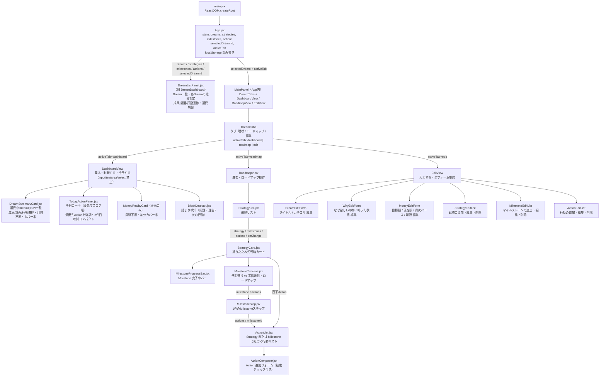
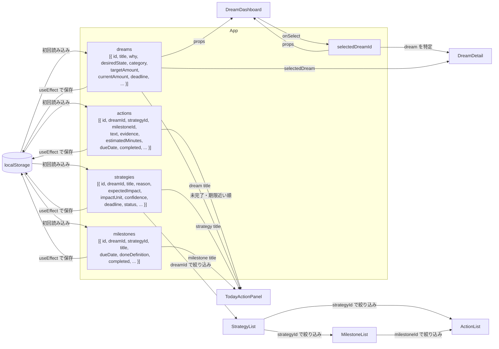
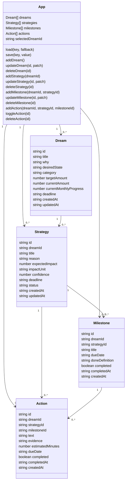
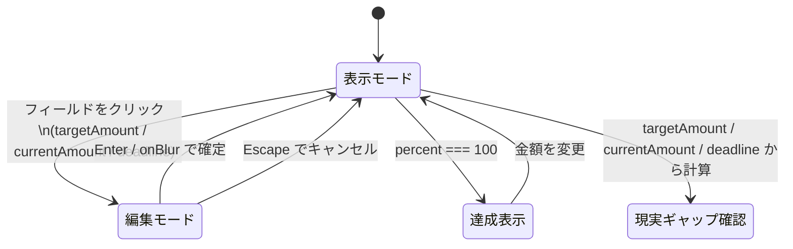
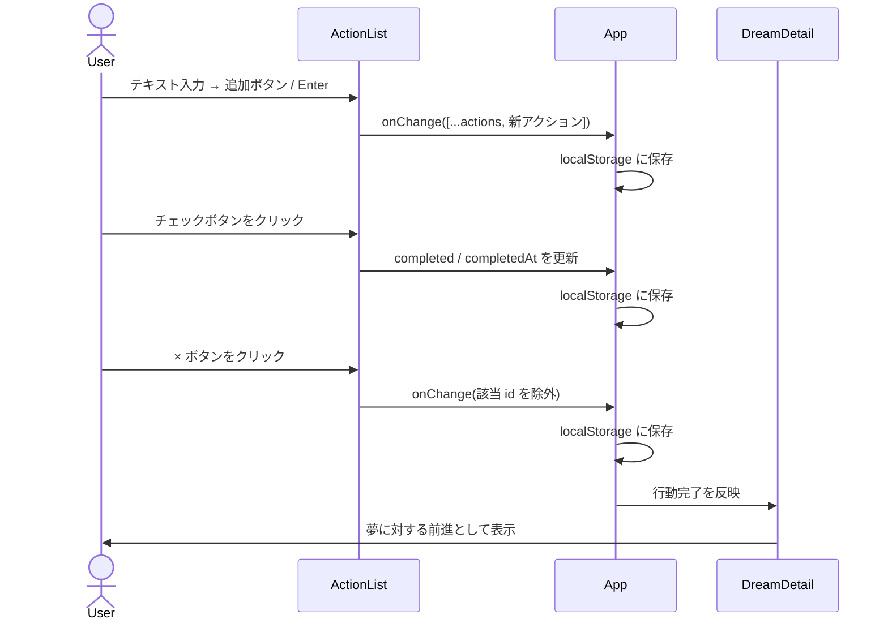
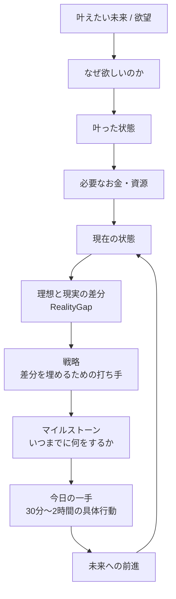
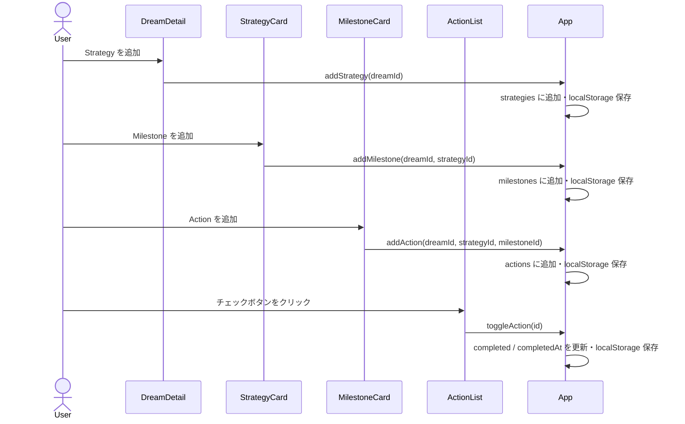
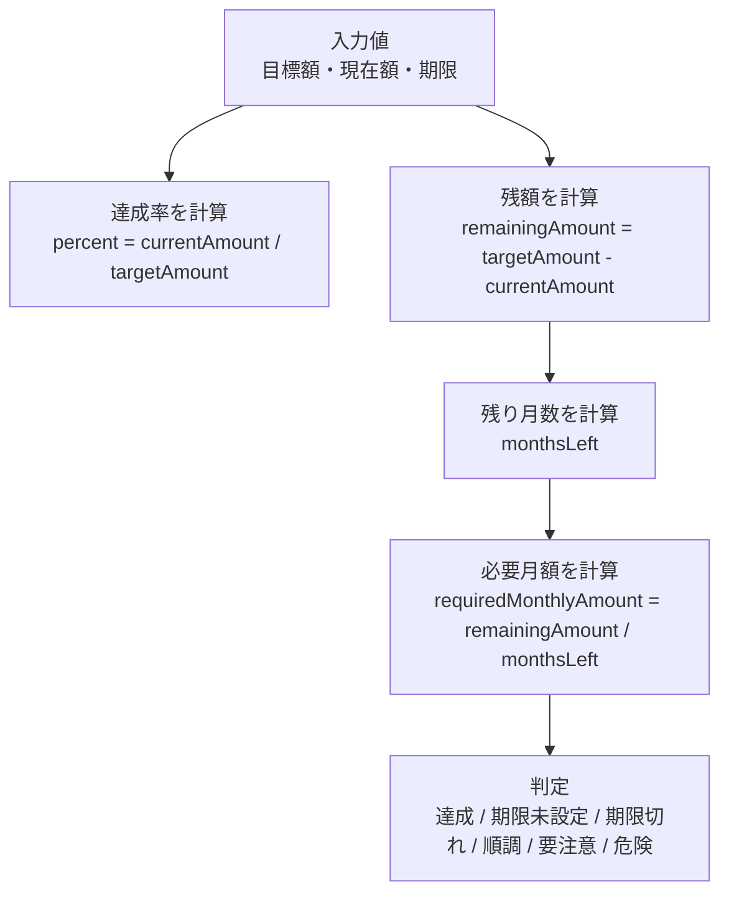
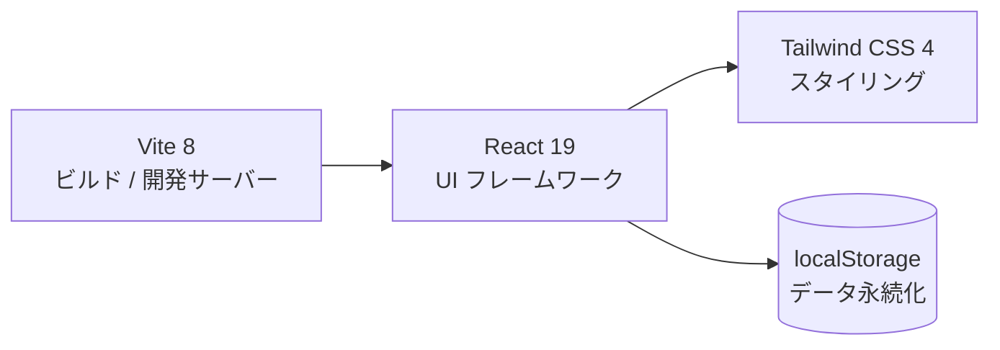

# MyCompass 設計書

## コンポーネント構成



## データフロー



## 状態定義



## MoneyGoalCard 内部状態遷移



## ActionList 操作フロー



## 欲望から行動への変換フロー



## Dream → Strategy → Milestone → Action の操作フロー



## RealityGapCard 計算フロー



## 技術スタック



## 型定義

```ts
type Dream = {
  id: string
  title: string
  why: string
  desiredState: string
  category: "home" | "birth" | "money" | "career" | "health" | "life"
  targetAmount: number
  currentAmount: number
  currentMonthlyProgress: number  // 現在の月次積立ペース（円）
  deadline: string
  createdAt: string
  updatedAt: string
}

type MilestoneComputedStatus = "completed" | "in_progress" | "not_started" | "overdue"

type DreamHealthStatus = "good" | "warning" | "danger"

type Strategy = {
  id: string
  dreamId: string
  title: string
  reason: string
  expectedImpact: number
  impactUnit: "monthly_yen" | "one_time_yen" | "habit" | "knowledge"
  confidence: 1 | 2 | 3 | 4 | 5
  deadline: string
  status: "idea" | "active" | "paused" | "done" | "abandoned"
  createdAt: string
  updatedAt: string
}

type Milestone = {
  id: string
  dreamId: string
  strategyId: string
  title: string
  dueDate: string
  doneDefinition: string
  completed: boolean
  completedAt: string | null
  createdAt: string
}

type Action = {
  id: string
  dreamId: string
  strategyId: string | null
  milestoneId: string | null
  text: string
  evidence: string
  estimatedMinutes: number
  dueDate: string
  completed: boolean
  completedAt: string | null
  createdAt: string
}
```

## 実装方針

MyCompassは、単なる貯金管理アプリでも、単なるToDoアプリでもない。
目的は、夢・目標・欲望を、現実の行動に変換すること。

基本の流れは以下。

```
叶えたい未来 / 欲望
↓
なぜ欲しいのか
↓
叶った状態
↓
必要なお金・資源
↓
現在の状態
↓
理想と現実の差分 (RealityGap)
↓
戦略 (Strategy)
↓
マイルストーン (Milestone)
↓
今日の一手 (Action: 30分〜2時間の具体行動)
↓
未来への前進
```

Actionは「副業をする」「痩せる」「家計を改善する」のような抽象的なものにしない。
そのような抽象行動はStrategyとして登録し、ActionはStrategyまたはMilestoneに紐づく具体行動に絞る。

既存の goal 単体管理は廃止し、dreams 配列に置き換える。
既存の Action は dreamId を持つ形に拡張し、必ずどのDreamに効く行動なのか分かるようにする。

## 実装する範囲

まずは「欲望 → 数字 → 戦略 → 行動」の接続を完成させる。

実装するものは以下。

- Dreamを複数登録できる
- Dreamを選択できる
- Dreamごとに title / why / desiredState / category / targetAmount / currentAmount / deadline を編集できる
- 達成率・残額・期限までの残り月数・必要月額を表示する
- RealityGapCardの下に Strategy 作成ボタンを置く
- Strategyを追加・編集・削除できる
- Strategyに title / reason / expectedImpact / impactUnit / confidence / deadline / status を入力できる
- Strategyに紐づくMilestoneを追加・編集・削除できる
- Milestoneに title / dueDate / doneDefinition を入力できる
- ActionをStrategyまたはMilestoneに紐づけて追加できる
- Actionに text / evidence / estimatedMinutes / dueDate を入力できる
- Action追加フォームに粒度ガイドを表示する
- Actionを完了・未完了に切り替えられる
- Actionを削除できる
- 未完了Actionを「今日の一手」として期限近い順に表示する
- TodayActionPanelに Dream / Strategy / Milestone / evidence / estimatedMinutes / dueDate を表示する
- localStorageに保存し、リロードしてもデータが残る

## 後回しにする範囲

以下は後回しにする。

- DailyLog
- WeeklyReview
- グラフ表示
- Export / Import
- Zodによる厳密なバリデーション
- バックエンド連携
- ログイン機能

## localStorage key

- `mycompass:dreams`
- `mycompass:strategies`
- `mycompass:milestones`
- `mycompass:actions`

既存データに欠けているフィールドは以下のデフォルト値で補完する。

**Dream の補完**

| フィールド | デフォルト値 |
|---|---|
| currentMonthlyProgress | 0 |

**Action の補完**

| フィールド | デフォルト値 |
|---|---|
| strategyId | null |
| milestoneId | null |
| evidence | "" |
| estimatedMinutes | 30 |
| dueDate | "" |

## 初期Dream

dreams が空の場合は、初期Dreamを1件作成する。

```ts
const initialDream = {
  id: crypto.randomUUID(),
  title: "新しい夢",
  why: "",
  desiredState: "",
  category: "life",
  targetAmount: 0,
  currentAmount: 0,
  deadline: "",
  createdAt: new Date().toISOString(),
  updatedAt: new Date().toISOString()
}
```

## 初期Strategy

```ts
const initialStrategy = {
  id: crypto.randomUUID(),
  dreamId,
  title: "",
  reason: "",
  expectedImpact: 0,
  impactUnit: "monthly_yen",
  confidence: 3,
  deadline: "",
  status: "idea",
  createdAt: new Date().toISOString(),
  updatedAt: new Date().toISOString()
}
```

## 初期Milestone

```ts
const initialMilestone = {
  id: crypto.randomUUID(),
  dreamId,
  strategyId,
  title: "",
  dueDate: "",
  doneDefinition: "",
  completed: false,
  completedAt: null,
  createdAt: new Date().toISOString()
}
```

## 初期Action

```ts
const initialAction = {
  id: crypto.randomUUID(),
  dreamId,
  strategyId,
  milestoneId,
  text: "",
  evidence: "",
  estimatedMinutes: 30,
  dueDate: "",
  completed: false,
  completedAt: null,
  createdAt: new Date().toISOString()
}
```

## 削除時のカスケード

| 削除対象 | 連動削除 |
|---|---|
| Dream を削除 | そのDreamに紐づくStrategy / Milestone / Action をすべて削除 |
| Strategy を削除 | そのStrategyに紐づくMilestone / Action をすべて削除 |
| Milestone を削除 | そのMilestoneに紐づくAction（milestoneId が一致するもの）をすべて削除 |

## 計算ロジック

MoneyGoalCardでは以下を計算する。

```ts
const percent = targetAmount > 0
  ? Math.min(100, Math.round((currentAmount / targetAmount) * 100))
  : 0

const remainingAmount = Math.max(0, targetAmount - currentAmount)
```

RealityGapCardでは以下を計算する。

```ts
function getMonthsLeft(deadline: string) {
  if (!deadline) return null
  const today = new Date()
  const end = new Date(deadline)
  const yearDiff = end.getFullYear() - today.getFullYear()
  const monthDiff = end.getMonth() - today.getMonth()
  return Math.max(0, yearDiff * 12 + monthDiff)
}

const remainingAmount = Math.max(0, targetAmount - currentAmount)
const monthsLeft = getMonthsLeft(deadline)
const requiredMonthlyAmount =
  monthsLeft && monthsLeft > 0
    ? Math.ceil(remainingAmount / monthsLeft)
    : remainingAmount
const monthlyShortfall = Math.max(0, requiredMonthlyAmount - currentMonthlyProgress)
```

状態判定は以下。

- `remainingAmount === 0`：達成
- deadlineなし：期限未設定
- `monthsLeft === 0` かつ `remainingAmount > 0`：期限切れ
- `requiredMonthlyAmount <= 50000`：順調
- `requiredMonthlyAmount <= 150000`：要注意
- `requiredMonthlyAmount > 150000`：危険

## 共有ユーティリティ（src/utils/progress.js）

```js
export function getProgressPercent(done, total) {
  if (!total || total <= 0) return 0
  return Math.min(100, Math.round((done / total) * 100))
}

export function sortByDueDate(items) {
  return [...items].sort((a, b) => {
    if (!a.dueDate && !b.dueDate) return 0
    if (!a.dueDate) return 1
    if (!b.dueDate) return -1
    return new Date(a.dueDate).getTime() - new Date(b.dueDate).getTime()
  })
}

export function isOverdue(dueDate, completed) {
  if (!dueDate || completed) return false
  return new Date(dueDate) < new Date()
}

export function formatYen(value) {
  return `${Number(value || 0).toLocaleString()}円`
}

export function getMilestoneStatus(milestone, actions) {
  const milestoneActions = actions.filter(a => a.milestoneId === milestone.id)
  const completedActions = milestoneActions.filter(a => a.completed)
  const actionProgress = milestoneActions.length > 0
    ? Math.round((completedActions.length / milestoneActions.length) * 100)
    : 0
  const overdue = milestone.dueDate && new Date(milestone.dueDate) < new Date() && !milestone.completed
  if (milestone.completed) return "completed"
  if (overdue) return "overdue"
  if (actionProgress > 0) return "in_progress"
  return "not_started"
}
```

## 進捗の3種類

MyCompassでは進捗を以下の3種類に分けて管理・表示する。

| 種類 | 定義 | 計算元 |
|---|---|---|
| 成果進捗 (Outcome Progress) | 目標金額がどれだけ達成されたか | currentAmount / targetAmount |
| 計画進捗 (Plan Progress) | Milestoneがどれだけ完了したか | 完了Milestone数 / 全Milestone数 |
| 行動進捗 (Action Progress) | Actionがどれだけ完了したか | 完了Action数 / 全Action数 |

## DreamDashboard 司令塔仕様

DreamDashboardは単なる一覧ではなく、各Dreamの状態を一目で判断できる司令塔とする。

**各Dreamカードに表示する項目**

- Dream title / deadline
- 成果進捗バー（%）
- 計画進捗バー（完了Milestone数 / 全Milestone数）
- 行動進捗バー（完了Action数 / 全Action数）
- 戦略カバー率（%）
- 期限切れAction・Milestone件数
- 今日の一手数（未完了・期限が今日以内）
- 総合判定

**総合判定ロジック**

```js
function getDreamHealthStatus({
  overdueActionCount,
  overdueMilestoneCount,
  strategyCoveragePercent,
  todayActionCount,
  planProgressPercent,
  actionProgressPercent
}) {
  if (overdueActionCount > 0 || overdueMilestoneCount > 0) return "danger"
  if (strategyCoveragePercent !== null && strategyCoveragePercent < 50) return "danger"
  if (todayActionCount === 0) return "warning"
  if (strategyCoveragePercent !== null && strategyCoveragePercent < 100) return "warning"
  if (planProgressPercent === 0 && actionProgressPercent === 0) return "warning"
  return "good"
}
```

| 値 | ラベル | 色 |
|---|---|---|
| good | 順調 | 緑 |
| warning | 要注意 | 黄 |
| danger | 要対策 | 赤 |

## Strategy 差分カバー率の計算

Dreamの必要月額に対して、戦略の合計効果がどのくらいカバーできているかを算出する。

```js
const remainingAmount = Math.max(0, dream.targetAmount - dream.currentAmount)

const requiredMonthlyAmount =
  monthsLeft && monthsLeft > 0
    ? Math.ceil(remainingAmount / monthsLeft)
    : remainingAmount

const requiredMonthlyGap = Math.max(
  0,
  requiredMonthlyAmount - dream.currentMonthlyProgress
)

const totalExpectedMonthlyImpact = strategies
  .filter(s => s.dreamId === dream.id)
  .filter(s => s.impactUnit === "monthly_yen")
  .filter(s => s.status !== "abandoned")
  .reduce((sum, s) => sum + Number(s.expectedImpact || 0), 0)

const strategyCoveragePercent =
  requiredMonthlyGap > 0
    ? Math.min(999, Math.round((totalExpectedMonthlyImpact / requiredMonthlyGap) * 100))
    : 100

const remainingMonthlyGap = Math.max(0, requiredMonthlyGap - totalExpectedMonthlyImpact)
```

**表示ルール**

- `strategyCoveragePercent >= 100`：計画上は到達可能
- `strategyCoveragePercent >= 50`：一部カバー
- `strategyCoveragePercent < 50`：戦略不足
- `requiredMonthlyGap === 0`：差分なし

## RealityGapCard 強化仕様

**表示項目**

- 目標額 / 現在額 / 残額 / 残り月数
- 必要月額
- 現在ペース（currentMonthlyProgress）
- 月間不足額（requiredMonthlyAmount − currentMonthlyProgress）
- 戦略合計効果（totalExpectedMonthlyImpact）
- 差分カバー率（strategyCoveragePercent）
- 残り必要戦略額（remainingMonthlyGap）
- 状態判定
- 「＋ 戦略を追加」ボタン

## Strategy 単位の進捗

```js
const strategyMilestones = milestones.filter(m => m.strategyId === strategy.id)
const completedMilestones = strategyMilestones.filter(m => m.completed)
const milestoneProgress = strategyMilestones.length > 0
  ? Math.round((completedMilestones.length / strategyMilestones.length) * 100)
  : 0

const strategyActions = actions.filter(a => a.strategyId === strategy.id)
const completedActions = strategyActions.filter(a => a.completed)
const actionProgress = strategyActions.length > 0
  ? Math.round((completedActions.length / strategyActions.length) * 100)
  : 0

// Milestoneがある場合はmilestoneProgressを優先
const overallProgress = strategyMilestones.length > 0 ? milestoneProgress : actionProgress
```

StrategyCardには以下を表示する。

- マイルストーン進捗：n / m 完了
- 行動進捗：n / m 完了
- 総合進捗バー

## Milestone 状態判定

```js
function getMilestoneStatus(milestone, actions) {
  const milestoneActions = actions.filter(a => a.milestoneId === milestone.id)
  const completedActions = milestoneActions.filter(a => a.completed)
  const actionProgress = milestoneActions.length > 0
    ? Math.round((completedActions.length / milestoneActions.length) * 100)
    : 0
  const overdue = milestone.dueDate && new Date(milestone.dueDate) < new Date() && !milestone.completed
  if (milestone.completed) return "completed"
  if (overdue) return "overdue"
  if (actionProgress > 0) return "in_progress"
  return "not_started"
}
```

| 状態 | ラベル | アイコン | 色 |
|---|---|---|---|
| completed | 完了 | ✅ | 緑 |
| in_progress | 進行中 | 🔵 | 青 |
| not_started | 未着手 | ⚪ | グレー |
| overdue | 期限切れ | 🔴 | 赤 |

## MilestoneTimeline 仕様

**表示順**：dueDate 昇順。dueDate なしは最後。

**MilestoneStep の表示内容**

- ステータスアイコン
- マイルストーン名（編集可）
- 期限（編集可）
- 完了条件（編集可）
- Action進捗（n / m 完了）
- 状態ラベル
- 完了チェック / 削除ボタン
- ActionList（展開式）

**予定進捗 vs 実績進捗**

```js
const plannedCompletedCount = strategyMilestones.filter(
  m => m.dueDate && new Date(m.dueDate) <= new Date()
).length

const actualCompletedCount = strategyMilestones.filter(m => m.completed).length

const plannedProgress = strategyMilestones.length > 0
  ? Math.round((plannedCompletedCount / strategyMilestones.length) * 100)
  : 0

const actualProgress = strategyMilestones.length > 0
  ? Math.round((actualCompletedCount / strategyMilestones.length) * 100)
  : 0

const delayPercent = Math.max(0, plannedProgress - actualProgress)
```

実績進捗が予定進捗を下回る場合、遅れとして視覚的に強調表示する。

## StrategyCard の構成

```
StrategyCard
├ 戦略タイトル・理由・期待効果・確信度・期限・ステータス
├ MilestoneProgressBar（Milestone完了率）
├ MilestoneTimeline（予定進捗 vs 実績進捗・ロードマップ）
│   └ MilestoneStep × n
│       └ ActionList
└ ActionList（milestoneId なしのStrategy直下Action）
```

## TodayActionPanel 優先度スコア

未完了Actionを単純な期限順ではなく優先度スコア順で表示する。

```js
function getActionPriorityScore(action, strategy, milestone) {
  let score = 0
  const today = new Date()

  if (action.dueDate) {
    const due = new Date(action.dueDate)
    const diffDays = Math.ceil((due - today) / (1000 * 60 * 60 * 24))
    if (diffDays < 0)       score += 100
    else if (diffDays === 0) score += 90
    else if (diffDays <= 3)  score += 70
    else if (diffDays <= 7)  score += 40
  }

  if (milestone?.computedStatus === "in_progress") score += 30

  if (strategy?.impactUnit === "monthly_yen") {
    score += Math.min(30, Math.round((strategy.expectedImpact || 0) / 10000))
  }

  if (action.estimatedMinutes && action.estimatedMinutes <= 60) score += 10
  if (action.evidence?.trim()) score += 5

  return score
}
```

スコア降順 → 同点は期限近い順 → 期限なしは最後。

**TodayActionPanel の各Actionに表示する項目**

- Action本文
- Dream名 / Strategy名 / Milestone名
- Milestone内Action進捗
- Evidence（なぜ必要か）
- 見積もり時間 / 期限
- 優先理由（スコア根拠の文言）

## ActionComposer 粒度チェック

以下に該当する場合、警告を表示する（登録はブロックしない）。

| 条件 | 内容 |
|---|---|
| estimatedMinutes > 120 | 2時間を超える |
| dueDate が未設定 | 期限なし |
| evidence が空 | 根拠なし |
| milestoneId が null | Milestoneに紐づいていない |
| text が抽象動詞で終わる | 「する」「始める」「頑張る」「改善する」「進める」 |
| text が短すぎる | 10文字未満 |

**警告文**

> このActionは大きすぎる可能性があります。
> 30分〜2時間で完了できる具体行動に分解してください。
> 例：副業をする → note記事タイトルを10個出す

## 詰まり検知（BlockDetector）

以下の状態を検知し、DreamDetailに表示する。

| 検知条件 | メッセージ例 |
|---|---|
| Dream に Strategy がない | Strategy が未作成です |
| Strategy に Milestone がない | 「〇〇」にマイルストーンがありません |
| Milestone に未完了Actionがない | 「〇〇」に次の行動がありません |
| Action に期限がない | 期限未設定のActionが n 件あります |
| Action に Evidence がない | 根拠未入力のActionが n 件あります |
| 期限切れ Action がある | 期限切れのActionが n 件あります |
| 期限切れ Milestone がある | 期限切れのMilestoneが n 件あります |

## DreamDetail の構成

```
DreamDetail
├ DreamSummaryCard  — KPI一覧（成果/計画/行動進捗・月間不足・カバー率・今日の一手数・期限切れ）
├ TodayActionPanel  — 今日の一手（SummaryCard直下、優先度スコア順）
├ MoneyRealityCard  — MoneyGoalCard + RealityGapCard を統合
│                     目標額/現在額/残額/期限/残り月数
│                     必要月額/現在ペース/月間不足
│                     戦略合計効果/差分カバー率/あと必要な月額
│                     └ 「＋ 戦略を追加」ボタン
├ WhyCard           — 通常時：読み物カード / 編集ボタン押下時のみfrom表示
├ BlockDetector     — 詰まり検知（問題・理由・次の行動）
└ StrategyList      — 戦略リスト
    └ StrategyCard  — 折りたたみ式戦略カード（1枚ずつ）
        ├ [通常表示] タイトル・ステータス・期限・期待効果・差分への貢献・確信度・進捗
        └ [展開時] なぜ必要か・MilestoneTimeline・ActionList・編集フォーム
            ├ MilestoneProgressBar
            ├ MilestoneTimeline（予定進捗 vs 実績進捗）
            │   └ MilestoneStep — ステータスアイコン・名前・期限・完了条件
            │       └ ActionList（展開式）
            └ ActionList（Milestone未所属のStrategy直下Action）
```

## RealityGapCard の補助文

RealityGapCard には以下の補助文を表示する。

> この差分を埋めるために、戦略を作成してください。
> 例：副業収入を作る、固定費を下げる、特別費を見直す

その下に「＋ 戦略を追加」ボタンを置く。

## TodayActionPanel の仕様

- 全 Dream を横断して未完了 Action を表示する
- 期限（dueDate）が近い順に並べる
- 期限なしの Action は最後に表示する
- 各 Action に以下を表示する
  - Action 本文
  - 紐づく Dream 名
  - 紐づく Strategy 名
  - 紐づく Milestone 名
  - なぜ必要か（evidence）
  - 見積もり時間（estimatedMinutes）
  - 期限（dueDate）

## ActionComposer の粒度ガイド

Action 追加フォームには以下の注意書きを表示する。

> Action は 30 分〜2 時間で実行できる具体行動にしてください。
> 「副業をする」「痩せる」「家計を改善する」のような大きすぎる行動は、戦略として登録してください。

## UI方針

Tailwind CSSで実装する。画面構成は以下。

**PC**
- 左側：DreamListPanel（固定 lg:w-72）
  - Dream一覧・各Dreamの総合判定・3種進捗ミニバー
- 右側：タブ（現状 / ロードマップ / 編集）＋タブ内コンテンツ
  - 現状タブ：DreamSummaryCard + TodayActionPanel + MoneyRealityCard（表示） + BlockDetector
  - ロードマップタブ：StrategyList + MilestoneTimeline + ActionList
  - 編集タブ：全入力フォーム

**スマホ**
- Header
- Dream切替（DreamListPanel）
- タブ（現状 / ロードマップ / 編集）
- タブ内コンテンツ（スクロール）

スマホは縦型タイムラインを基本。PCはDreamListPanelとMainPanelが横並び。

**状態色の統一**

| 意味 | 色 |
|---|---|
| 完了 | 緑（emerald） |
| 進行中 | 青（blue / indigo） |
| 未着手 | グレー（slate） |
| 期限切れ | 赤（red） |
| 要注意 | 黄（yellow / amber） |
| 要対策 | 赤（red） |
| 順調 | 緑（emerald） |

## 文言方針

使う文言は以下。

- 夢
- 叶えたい未来
- なぜ欲しいのか
- 叶った状態
- 理想と現実の差分
- 成果進捗 / 計画進捗 / 行動進捗
- 戦略
- なぜ必要か
- 根拠
- マイルストーン
- ロードマップ
- 完了条件
- 進行中 / 未着手 / 期限切れ
- 今日の一手
- 未来に効く行動
- 詰まり検知

避ける文言は以下。

- タスク管理
- 作業
- 単なるToDo

## 完了条件

以下を満たしたら完了。

**DreamListPanel（旧DreamDashboard）**
- 成果進捗・計画進捗・行動進捗バーが表示される
- 戦略カバー率が表示される
- 期限切れ件数・今日の一手数が表示される
- 総合判定（順調 / 要注意 / 要対策）が表示される

**DreamSummaryCard（新規）**
- DreamDetailの最上部に表示される
- 成果進捗・計画進捗・行動進捗を進捗バーで表示する
- 月間不足・戦略カバー率・今日の一手数・期限切れ件数を表示する
- 総合判定バッジを表示する

**TodayActionPanel（位置変更）**
- DreamSummaryCardの直下に配置される（画面下部ではなく）
- 最優先Actionを最も目立たせる
- 2件目以降はコンパクト表示にする
- 優先度スコア順に表示される
- Dream / Strategy / Milestone / Evidence / estimatedMinutes / dueDate が表示される
- 優先理由が表示される

**MoneyRealityCard（新規・統合）**
- MoneyGoalCardとRealityGapCardが統合されMoneyRealityCardになっている
- 目標額/現在額/残額/期限/残り月数を表示する
- 必要月額/現在ペース/月間不足を表示する（月間不足を大きく表示）
- 戦略合計効果/差分カバー率/あと必要な月額を表示する（差分カバー率を大きく表示）
- 状態判定を表示する
- 「＋ 戦略を追加」ボタンを含む

**WhyCard（表示改善）**
- 通常時は読み物カードとして「なぜ欲しいのか」「叶った状態」をテキスト表示する
- 右上の「編集」ボタンを押したときのみtextareaを表示する

**編集ボタン方針**
- WhyCard・MoneyRealityCard（旧MoneyGoalCard）・StrategyCard・MilestoneStep・ActionListのフォームは常時表示しない
- 各カードの右上に「編集」ボタンを配置し、押下時のみフォームを表示する
- 保存はonBlurまたは保存ボタンで行う

**StrategyCard（折りたたみ改善）**
- 通常時はタイトル・ステータス・期限・期待効果・確信度・進捗のみコンパクト表示
- 展開時にのみ：なぜ必要か・MilestoneTimeline・ActionList・編集フォームを表示

**MilestoneTimeline**
- Milestoneが期限順に並ぶ
- 各MilestoneにcompletedStatus（完了/進行中/未着手/期限切れ）が表示される
- Milestone内のAction進捗が表示される
- 予定進捗・実績進捗・遅れ（%）が表示される

**BlockDetector（表示改善）**
- 各詰まりを「問題・理由・次の行動」の3点で表示する

**ActionComposer**
- 抽象的すぎるActionに警告が出る（登録はブロックしない）

**データ整合性**
- Dream に currentMonthlyProgress がない場合は 0 で補完される
- 既存Actionに欠けているフィールドはデフォルト値で補完される
- Dream / Strategy / Milestone 削除時にカスケード削除される
- localStorageに保存され、リロードしてもデータが残る
- `npm run build` が通る

---

## UI改善仕様（第3次改修）

### 改修方針

現在の実装は入力フォーム中心になっている。以下を重視して「現状を把握し、次にやることが分かる画面」に改める。

- 目的に接続していることが一目で分かる
- 目的に対してどのくらい進んでいるかが一目で分かる
- 今日何をやるべきかがすぐ分かる
- 入力フォームと出力表示を分ける
- 文字量を減らし、進捗バー・バッジ・大きな数字・タイムラインで見せる
- textarea / input を常時表示しない
- 編集は「編集」ボタンを押したときだけ表示する

### DreamSummaryCard 仕様

DreamDetailの最上部に選択中DreamのKPIを集約表示するカードを追加する。

**表示内容**

| 項目 | 説明 |
|---|---|
| Dream title | 選択中のDreamタイトル |
| 総合判定バッジ | good / warning / danger |
| 成果進捗 | currentAmount / targetAmount（進捗バー付き） |
| 計画進捗 | 完了Milestone数 / 全Milestone数（進捗バー付き） |
| 行動進捗 | 完了Action数 / 全Action数（進捗バー付き） |
| 月間不足 | requiredMonthlyAmount - currentMonthlyProgress |
| 戦略カバー率 | strategyCoveragePercent（%） |
| 今日の一手数 | 期限が今日以内の未完了Action数 |
| 期限切れ件数 | 期限切れの未完了Action + Milestone数 |

**表示例**

```
産休育休で余裕を持って生活できるようにする    要対策

成果進捗  ████░░░░░░ 0%
計画進捗  ████░░░░░░ 0%
行動進捗  ████░░░░░░ 0%

月間不足：125,000円  戦略カバー率：0%
今日の一手：5件     期限切れ：0件
```

**ファイル**：`src/components/DreamSummaryCard.jsx`

**Props**

```ts
interface DreamSummaryCardProps {
  dream: Dream
  strategies: Strategy[]
  milestones: Milestone[]
  actions: Action[]
}
```

### TodayActionPanel 配置変更

TodayActionPanelをDreamSummaryCardの直下に移動する（現在の画面下部から変更）。

**最優先Action（1件目）の表示**

```
最優先
[ ] プロフィール作成

理由：
副業戦略の最初のマイルストーンで、発信開始の前提になるため

見積もり：30分
期限：2026/07/14
効く夢：産休育休で余裕を持って生活できるようにする
戦略：副業で収入を得る
マイルストーン：プロフィール作成
```

- タイトルフォント・枠・背景色で最優先であることを視覚的に強調する
- 優先度スコアが最も高いActionに「最優先」ラベルを付ける

**2件目以降はコンパクト表示**

- Action本文・期限・見積もり時間のみ表示
- 詳細（理由・パンくず）は省略
- 「すべて表示」トグルで全件表示できるようにする

**TodayActionPanelの受け取りデータ**

DreamDetailから渡す場合は選択中Dreamのactionのみ。
App全体からは全dreamのactionを渡して横断表示も可能。（現在の実装を維持）

### MoneyRealityCard 仕様

MoneyGoalCard と RealityGapCard を統合して MoneyRealityCard.jsx を作成する。

**表示内容（上から順）**

```
お金の現実                      [編集]

目標額：1,500,000円
現在額：0円
残額：1,500,000円
期限：2027/06/30
残り：12ヶ月

━━ 月次分析 ━━
必要月額：125,000円
現在ペース：0円
月間不足：125,000円  ← 大きく表示（赤）

━━ 戦略効果 ━━
戦略合計効果：0円
差分カバー率：0%     ← 大きく表示
あと必要：125,000円/月

判定：要対策
```

**大きく表示する項目**

- 月間不足（赤文字・大フォント）
- 差分カバー率（状態色・大フォント）
- あと必要な月額（赤文字）

**編集モード**

右上「編集」ボタン押下時のみ、以下の入力フォームを表示する。

- 目標金額（number input）
- 現在の金額（number input）
- 現在の月収ペース（number input）
- 期限（date input）

**ファイル**：`src/components/MoneyRealityCard.jsx`

**削除するファイル**：`MoneyGoalCard.jsx`、`RealityGapCard.jsx`（MoneyRealityCardに統合）

### WhyCard 読み物カード仕様

WhyCardは通常時、入力フォームではなく読みやすいテキストとして表示する。

**通常表示**

```
なぜ欲しいのか
今のままだと赤字になる。お金を理由に育休を不安にしたくない。

叶った状態
産休育休中も毎月の生活費が不足せず、貯金を崩しすぎずに暮らせる。
```

**編集時（「編集」ボタン押下後）**

- なぜ欲しいのか → textarea
- 叶った状態 → textarea
- 「完了」ボタンで通常表示に戻る

**空の場合**

- `「なぜ欲しいのか」を入力してください` などのプレースホルダーテキストを表示する
- または「編集」ボタンを押して入力を促す

### StrategyCard 折りたたみ仕様

#### 通常表示（折りたたみ時）

```
▶  副業で収入を得る                [実行中]  [確信度●●●○○]

   期待効果：月5万円  貢献度：40%
   期限：2026/12/31
   計画 2/5  行動 3/10
```

- タイトル・ステータスバッジ・確信度
- 期待効果と差分への貢献度（strategyCoveragePercent に対するこの戦略の寄与）
- 期限
- マイルストーン進捗（n/m）・行動進捗（n/m）

#### 展開表示

```
▼  副業で収入を得る                [実行中]  [確信度●●●○○]

   なぜ必要か
   産休中に収入が途切れるため、副業で月5万円の収入源を作る。

   ロードマップ
   予定進捗 ████░░░░ 40%
   実績進捗 ██░░░░░░ 20%  ← 20%遅れ

   ⚪ プロフィール作成      期限：2026/07/14  0/1
   ⚪ 調査する             期限：2026/07/14  0/1
   ⚪ 記事を書く           期限：未設定       0/1

   [戦略直下の行動]
   [ ] テーマ選定をする  2026/07/10  30分

   [編集]
   ステータス・確信度・なぜ必要か・期待効果・単位・期限
```

**編集フォームの表示タイミング**

- 「編集」ボタンを押したときのみフォームを表示する
- 通常展開では読み取り専用のテキストとして表示する

### BlockDetector 改善仕様

各詰まりを以下の3点セットで表示する。

```
詰まり検知  2件

⚠ 戦略カバー率が0%です
  理由：月125,000円不足に対して、戦略効果が設定されていません
  次の行動：戦略の期待効果を入力してください

⚠ 未完了Actionが5件あります
  理由：今日の一手候補があります
  次の行動：最優先Actionを1つ完了してください
```

**検知項目と3点セット定義**

| 問題 | 理由 | 次の行動 |
|---|---|---|
| 戦略がない | 差分を埋める手段がない | 戦略を追加してください |
| 戦略カバー率が低い（<50%） | 月n円不足に対して戦略効果が不足 | 戦略の期待効果を入力してください |
| マイルストーンがない戦略がある | 実行計画が未定 | 「〇〇」にマイルストーンを追加してください |
| 次の行動がないマイルストーンがある | 当該マイルストーンが止まっている | 「〇〇」に行動を追加してください |
| 期限切れActionがある | 計画が遅延している | 期限切れのActionを確認・更新してください |
| 期限切れMilestoneがある | ロードマップが遅延している | 期限切れのMilestoneを確認・更新してください |
| 期限未設定Actionが多い | 優先度管理ができない | Actionに期限を設定してください |
| 根拠未入力Actionが多い | 行動の根拠が不明 | Actionに根拠（evidence）を入力してください |

### 編集ボタン方針

フォームを常時表示しない。すべてのカードで「表示モード / 編集モード」を切り替える。

**対象コンポーネント**

| コンポーネント | 通常時 | 編集時 |
|---|---|---|
| WhyCard | テキスト表示（why / desiredState） | textarea（why / desiredState） |
| MoneyRealityCard | 数値一覧表示 | number input / date input |
| StrategyCard | タイトル等の読み取り表示 | ステータス・確信度・理由等の入力フォーム |
| MilestoneStep | タイトル・期限・完了条件のテキスト | input / date / textarea |
| ActionList | Action本文・期限・見積もりのテキスト | ActionComposerフォーム |

**実装パターン**

```jsx
const [editing, setEditing] = useState(false)

// 通常表示
{!editing && (
  <div className="relative">
    <button onClick={() => setEditing(true)} className="absolute top-0 right-0 text-xs text-slate-400">
      編集
    </button>
    <p>{dream.why || '「なぜ欲しいのか」を入力...'}</p>
  </div>
)}

// 編集表示
{editing && (
  <div>
    <textarea value={draft} onChange={e => setDraft(e.target.value)} />
    <button onClick={() => { onChange({ why: draft }); setEditing(false) }}>完了</button>
  </div>
)}
```

### 視覚表現ガイドライン

以下を積極的に使用する。

| 表現 | 用途 |
|---|---|
| 進捗バー | 成果/計画/行動進捗 |
| ステータスバッジ | 総合判定・Milestone状態・Strategy状態 |
| 信号色 | 順調（緑）・要注意（黄）・要対策（赤） |
| アイコン | Milestone状態（✅🔵⚪🔴） |
| 大きな数字 | 月間不足・差分カバー率・あと必要な月額 |
| 折りたたみ | StrategyCard・MilestoneStep |
| タイムライン | MilestoneTimeline |
| 優先度ラベル | TodayActionPanel最優先Action |

**状態色の統一（更新）**

| 意味 | Tailwind |
|---|---|
| 順調 / 完了 | emerald（緑） |
| 進行中 | blue / indigo（青） |
| 未着手 | slate（グレー） |
| 期限切れ | red（赤） |
| 要注意 | yellow / amber（黄） |
| 要対策 | red（赤） |
| 最優先 | indigo bg + white text |

---

## 3画面アーキテクチャ（第4次改修）

### 改修方針

現在は「見る」「進める」「入力する」が1画面に混在しており、どの操作をすべきか分かりにくい。
3つのタブに分けることで、ユーザーが今何をすべき画面にいるかを明確にする。

| タブ | 目的 | 許可する操作 |
|---|---|---|
| 現状（Dashboard） | 見る・判断する・今日やる | TodayActionのチェックのみ |
| ロードマップ（Roadmap） | 進む・計画を進める | 展開/折りたたみ・Action完了・Action追加 |
| 編集（Edit） | 入力する・データを整える | 全フォーム（Dream/Strategy/Milestone/Action） |

### App コンポーネント状態変更

```jsx
// 追加するstateのみ（既存stateは変わらない）
const [activeTab, setActiveTab] = useState('dashboard')
// activeTab: 'dashboard' | 'roadmap' | 'edit'
```

### DreamListPanel（旧 DreamDashboard）

**ファイル**：`src/components/DreamListPanel.jsx`（`DreamDashboard.jsx` からリネーム）

**変更点**：ファイル名・コンポーネント名のみ変更。内部ロジックは同一。

**Props**（変更なし）

```ts
interface DreamListPanelProps {
  dreams: Dream[]
  strategies: Strategy[]
  milestones: Milestone[]
  actions: Action[]
  selectedDreamId: string
  onSelect: (id: string) => void
  onAdd: () => void
  onDelete: (id: string) => void
}
```

### DreamTabs 仕様

タブ切替コンポーネント。App（またはMainPanel）内にインラインで実装する。

**表示**

```
[現状]  [ロードマップ]  [編集]
```

- アクティブタブ：indigo の下線 + indigo テキスト
- 非アクティブタブ：slate テキスト + hover で slate-200 背景

**実装パターン**

```jsx
const TABS = [
  { key: 'dashboard', label: '現状' },
  { key: 'roadmap',   label: 'ロードマップ' },
  { key: 'edit',      label: '編集' },
]

<div className="flex border-b border-slate-200 mb-4">
  {TABS.map(tab => (
    <button
      key={tab.key}
      onClick={() => setActiveTab(tab.key)}
      className={`px-4 py-2 text-sm font-medium transition-colors border-b-2 -mb-px ${
        activeTab === tab.key
          ? 'text-indigo-600 border-indigo-600'
          : 'text-slate-500 border-transparent hover:text-slate-700'
      }`}
    >
      {tab.label}
    </button>
  ))}
</div>
```

### DashboardView 仕様

**目的**：現状を把握し、今日やることを判断する。

**コンポーネント構成**

```
DashboardView
├ DreamSummaryCard    ← KPI一覧・3種進捗・総合判定
├ TodayActionPanel    ← 今日の一手（チェックのみ許可）
├ MoneyRealityCard    ← 読み取り専用モードで表示（編集ボタンは非表示）
└ BlockDetector       ← 詰まり検知（問題・理由・次の行動）
```

**禁止事項**

- `<input>`, `<textarea>`, `<select>` を一切置かない
- 編集ボタン・追加ボタンを一切置かない
- 唯一許可するインタラクション：TodayActionPanel の完了チェック（`onToggle`）

**MoneyRealityCard をDashboardViewに表示する際の注意**

- `readOnly` prop（または `showEditButton={false}` prop）を渡して編集機能を非活性にする
- 表示内容（月間不足・差分カバー率・状態判定）は同じ

**ファイル**：`src/components/DashboardView.jsx`

**Props**

```ts
interface DashboardViewProps {
  dream: Dream
  strategies: Strategy[]
  milestones: Milestone[]
  actions: Action[]
  onToggleAction: (id: string) => void
  onDeleteAction: (id: string) => void
}
```

**TodayActionPanel への dreams 渡し方**

DashboardView では `dreams={[dream]}` （選択中の Dream 1件のみ）を渡す。
TodayActionPanel のパンくず表示に使うが、actions は全て同じ Dream のものなので1件で十分。

### RoadmapView 仕様

**目的**：ロードマップを進める。戦略・マイルストーン・行動を操作する。

**コンポーネント構成**

```
RoadmapView
└ StrategyList
   └ StrategyCard（折りたたみ・展開）
      ├ MilestoneProgressBar
      ├ MilestoneTimeline
      │  └ MilestoneStep（折りたたみ・展開）
      │     └ ActionList（行動完了・追加）
      └ ActionList（戦略直下Action）
```

**許可する操作**

| 操作 | 許可 |
|---|---|
| StrategyCard 展開 / 折りたたみ | ○ |
| MilestoneStep 展開 / 折りたたみ | ○ |
| Action 完了チェック | ○ |
| Action 追加（ActionComposer） | ○ |
| Milestone 追加 | ○ |
| Strategy 追加 | ○ |

**禁止する操作**

| 操作 | 禁止理由 |
|---|---|
| Dream/WhyCard/MoneyRealityCard の編集 | EditView で行う |
| Strategy のタイトル・ステータス等の編集 | EditView で行う |
| Milestone のタイトル・期限等の編集 | EditView で行う |

RoadmapViewでのStrategyCardは「展開＝閲覧＋Action操作」モードのみ使用。
編集ボタンは表示しない（または押したら「編集タブで行ってください」と案内する）。

**ファイル**：`src/components/RoadmapView.jsx`

**Props**

```ts
interface RoadmapViewProps {
  strategies: Strategy[]
  milestones: Milestone[]
  actions: Action[]
  onAddStrategy: () => void
  onAddMilestone: (strategyId: string) => void
  onToggleMilestone: (id: string) => void
  onAddAction: (strategyId: string | null, milestoneId: string | null, fields: object) => void
  onToggleAction: (id: string) => void
  onDeleteAction: (id: string) => void
}
```

**空状態の表示**

`strategies.length === 0` の場合は「まだ戦略がありません」と「＋ 最初の戦略を追加」ボタンを表示する。
誘導テキスト（「編集タブで追加してください」）は表示しない — ボタンで直接追加できるため。

### EditView 仕様

**目的**：全データを入力・編集する。入力フォームはここに集約する。

**コンポーネント構成**

```
EditView
├ DreamEditForm（インライン）  ← タイトル・カテゴリ
├ WhyCard（autoEdit=true）    ← 入力フォームをデフォルト表示
├ MoneyRealityCard            ← 編集ボタン付き（readOnly=false）
├ BlockDetector               ← 何を入力すべきかのガイド
└ StrategyList                ← 戦略・マイルストーン・行動の全編集
```

**WhyCard の autoEdit**

`<WhyCard autoEdit />` を渡すと mount 時から editing=true（フォーム直接表示）。
キャンセルまたは完了後は通常の表示モードに戻り、「編集」ボタンで再度開ける。

**許可する操作**（EditViewはすべての編集を許可）

- DreamのすべてのフィールドをCRUD
- StrategyのすべてのフィールドをCRUD
- MilestoneのすべてのフィールドをCRUD
- ActionのすべてのフィールドをCRUD

**実装優先度**

既存コンポーネントの編集フォームを EditView に移植する形で実装する。
- WhyEditForm = WhyCard の編集モード部分を抽出
- MoneyEditForm = MoneyRealityCard の編集モード部分を抽出
- StrategyEditList = StrategyCard の編集モード部分を集約リスト形式に
- MilestoneEditList = MilestoneStep の編集フォームを集約リスト形式に
- ActionEditList = ActionComposer ベースの編集リスト

**ファイル**：`src/components/EditView.jsx`

**Props**

```ts
interface EditViewProps {
  dream: Dream
  strategies: Strategy[]
  milestones: Milestone[]
  actions: Action[]
  onChange: (patch: Partial<Dream>) => void
  onAddStrategy: () => void
  onUpdateStrategy: (id: string, patch: Partial<Strategy>) => void
  onDeleteStrategy: (id: string) => void
  onAddMilestone: (strategyId: string) => void
  onUpdateMilestone: (id: string, patch: Partial<Milestone>) => void
  onDeleteMilestone: (id: string) => void
  onAddAction: (strategyId: string | null, milestoneId: string | null, fields: object) => void
  onUpdateAction?: (id: string, patch: Partial<Action>) => void
  onDeleteAction: (id: string) => void
}
```

### PC レイアウト

```
┌─────────────────────────────────────────────────────────┐
│  🧭 MyCompass  叶えたい未来を、今日の一手に変える          │  header
├──────────────┬──────────────────────────────────────────┤
│              │  [現状]  [ロードマップ]  [編集]             │  DreamTabs
│ DreamList    ├──────────────────────────────────────────┤
│ Panel        │                                           │
│ (lg:w-72)    │  DashboardView / RoadmapView / EditView  │
│ 固定         │                                           │
│              │                                           │
└──────────────┴──────────────────────────────────────────┘
```

- 左パネル（DreamListPanel）は固定幅 `lg:w-72 flex-shrink-0`
- 右パネル（MainPanel）は `flex-1 min-w-0`
- タブはMainPanelの最上部

### モバイルレイアウト

```
┌─────────────────────────┐
│  🧭 MyCompass           │  header
├─────────────────────────┤
│  Dream切替              │  DreamListPanel（横スクロール or ドロップダウン）
├─────────────────────────┤
│  [現状] [ロードマップ] [編集] │  DreamTabs
├─────────────────────────┤
│                         │
│  タブ内コンテンツ         │  DashboardView / RoadmapView / EditView
│                         │
└─────────────────────────┘
```

- DreamListPanelはモバイルでは横スクロールカード列またはドロップダウン形式
- タブはスティッキーで上部固定が望ましい

### App.jsx の変更点

```jsx
// 追加するimport
import DreamListPanel from './components/DreamListPanel'  // DreamDashboard → DreamListPanel
import DashboardView from './components/DashboardView'
import RoadmapView from './components/RoadmapView'
import EditView from './components/EditView'

// 追加するstate
const [activeTab, setActiveTab] = useState('dashboard')

// JSX変更（DreamDashboard → DreamListPanel、DreamDetail → タブ制御に変更）
<DreamListPanel ... />

{/* タブ */}
<div className="flex border-b border-slate-200 mb-4">
  {TABS.map(tab => <button key={tab.key} ...>{tab.label}</button>)}
</div>

{/* タブコンテンツ */}
{activeTab === 'dashboard' && <DashboardView ... />}
{activeTab === 'roadmap'   && <RoadmapView ... />}
{activeTab === 'edit'      && <EditView ... />}
```

### 完了条件（第4次改修）

**DreamListPanel**
- 旧 DreamDashboard と同一機能が動作する
- ファイル名が `DreamListPanel.jsx` になっている
- App からのインポートが `DreamListPanel` になっている

**DreamTabs**
- 「現状」「ロードマップ」「編集」の3タブが表示される
- タブをクリックすると表示が切り替わる
- アクティブタブが indigo で強調される

**DashboardView**
- DreamSummaryCard が表示される
- TodayActionPanel が表示され、完了チェックができる
- MoneyRealityCard が読み取り専用で表示される
- BlockDetector が表示される
- input / textarea / select が一切ない

**RoadmapView**
- StrategyList → StrategyCard → MilestoneTimeline → MilestoneStep → ActionList が表示される
- 展開 / 折りたたみができる
- Action の完了チェックができる
- Action の追加ができる
- 編集フォーム（Strategy/Milestone の input 等）は表示されない

**EditView**
- Dream タイトル・カテゴリを編集できる
- なぜ欲しいのか・叶った状態を編集できる（WhyCard がデフォルトでフォームを表示する）
- 目標額・現在額・月次ペース・期限を編集できる
- Strategy を追加・編集・削除できる
- Milestone を追加・編集・削除できる
- Action を追加・編集・削除できる

---

## バグ修正・UX改善（第5次改修）

第4次実装後のレビューで発見した問題を修正した。

### 修正内容

**1. BlockDetector の「次の行動」テキスト修正**

- 修正前：「下の「＋ 戦略を追加」ボタンで戦略を追加してください」
- 修正後：「「編集」タブから戦略を追加してください」
- 理由：DashboardView では MoneyRealityCard が readOnly のため「戦略を追加」ボタンが存在せず、指示通りに動けない

**2. RoadmapView 空状態メッセージの矛盾を解消**

- 修正前：「編集タブで戦略を追加してください」という誘導文＋追加ボタン（矛盾）
- 修正後：「まだ戦略がありません」＋追加ボタンのみ
- 理由：誘導とボタンが矛盾していた

**3. WhyCard に autoEdit prop を追加**

- `WhyCard` に `autoEdit = false` prop を追加
- `useState(autoEdit)` で mount 時から editing=true にできる
- EditView では `<WhyCard autoEdit />` を渡し、フォームを即表示
- 理由：「編集タブ」に来たのにさらに「編集」ボタンを押す二重手順の解消

**4. DashboardView の dreams prop 削除・簡略化**

- 修正前：`dreams: Dream[]`（全 Dream 配列）を受け取り TodayActionPanel に渡していた
- 修正後：`dreams={[dream]}`（選択中の Dream 1件）を TodayActionPanel に渡す
- 理由：DashboardView の actions は全て selectedDream のものなのでパンくず表示に1件あれば充分

**5. RoadmapView の未使用 `dream` prop 削除**

- Props から `dream` を削除
- 理由：関数内で一度も参照されていなかった

**6. 不要ファイル削除（6件）**

以下の旧実装ファイルをリポジトリから削除した。

| 削除ファイル | 理由 |
|---|---|
| `DreamDashboard.jsx` | `DreamListPanel.jsx` に置き換え済み |
| `DreamDetail.jsx` | 3ビュー（Dashboard/Roadmap/Edit）に分割済み |
| `MilestoneCard.jsx` | 旧実装（未使用） |
| `MilestoneList.jsx` | 旧実装（未使用） |
| `MoneyGoalCard.jsx` | `MoneyRealityCard.jsx` に統合済み |
| `RealityGapCard.jsx` | `MoneyRealityCard.jsx` に統合済み |

### 残存する既知の問題

| 問題 | 優先度 | 対応方針 |
|---|---|---|
| タブ切替で未保存の編集内容が消える | 中 | タブ離脱前に警告 or 自動保存 |
| DashboardView に「なぜ欲しいのか」が表示されない | 低 | WhyCard の読み取り表示を Dashboard にも追加するか検討 |
| EditView で MoneyRealityCard がデフォルト閲覧モード | 低 | `autoEdit` prop 追加で解消可能 |
